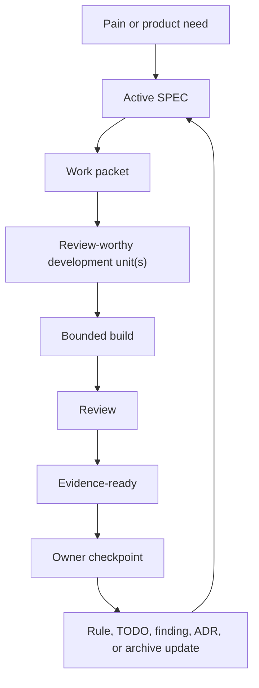

# SPEC-Driven AI Development

A control layer for AI coding: turn specs, agents, and outputs into a governed
development loop.

Status: `1.2.0` stable documentation/package release.

Effectiveness depends on project fit, owner discipline, and evidence quality.

Works with Codex, Claude Code, Cursor, Copilot Chat, and generic AI coding
agents.

<p>
  <a href="https://github.com/sponsors/LiveTrack-X">
    
  </a>
  <a href="https://buymeacoffee.com/livetrack">
    
  </a>
</p>


## Start Here: User Guide

If you are not sure what to do, start with
[docs/user-guide.md](docs/user-guide.md).
Localized versions:
[한국어](docs/user-guide.ko.md),
[中文](docs/user-guide.zh.md),
[日本語](docs/user-guide.ja.md).

It answers practical questions like:

- which scale to use: One-shot, Mini, Standard, or Full,
- what to type when you do not know SDAD terms or skill names,
- what to do when AI asks for approval too often,
- what to do when AI runs ahead too much,
- what context the AI should load now versus keep on demand,
- what evidence to require when AI says "done",
- when to use implementation notes, ADRs, save-state, or handoff.

The copy-paste prompt below is for running SDAD in an AI coding tool. The user
guide is the human-facing explanation.

## Copy-Paste Start Prompt

No terminal. No Git. No Python required.

The block below is an execution prompt for your AI coding tool. It is not the
main explanation of SDAD.

1. Open your project in an AI coding tool that can edit files, such as Codex,
   Claude Code, Cursor, or Copilot Chat.
2. Paste the text below.
3. Let the AI choose the scale and create only the files that scale needs.

```text
Use SPEC-Driven AI Development as the project control method.

Source:
https://github.com/LiveTrack-X/spec-driven-ai-development

First determine whether you can edit files in this project.
If this is a chat-only environment such as Claude.ai, ChatGPT web, or another
browser chat with no project filesystem, do not install adapters or claim files
were saved. Use this repository for planning only, then tell me to open the
project in Codex, Claude Code, Cursor, Copilot Chat, or another file-editing AI
coding tool.

Step 0 - Choose scale before creating files.

Ask me these five questions:
1. Will this take more than one AI session?
2. Will I come back to this project later?
3. Does "done" need evidence beyond "AI said so"?
4. Will multiple AI tools or reviewers be involved?
5. Is there release, migration, user data, auth, money, or production risk?

Choose:
- 0 yes -> One-shot prompt. Do not create project files.
- 1-2 yes from questions 1-3 only, with Q4=no and Q5=no -> Mini SDAD.
  Create only one instruction file.
- Q4=yes or 3 yes total -> Standard SDAD. Create core control files.
- Q5=yes -> Standard SDAD minimum, even if it is the only yes.
- Q5=yes with production-facing, destructive, migration, real user data, auth,
  money, release, or rollback risk -> Full SDAD.
- 4-5 yes -> Full SDAD. Use full workflow, review, ADRs, and gates.

Override rules beat raw yes-counts. When unsure, choose the smaller scale only
if no Q5 risk exists, and explain why.

Step 0.1 - Check product evidence flag.

Ask whether product, hardware, compatibility, packaging, remote tester,
external lab, or release claims need evidence stronger than local software
tests. A yes is not automatically Full SDAD, but it triggers the relevant
product evidence templates. Use Standard SDAD minimum when those templates must
persist across sessions. Q5 release, production, user data, auth, money,
migration, destructive-action, or rollback risk still controls Full SDAD gates.

Step 0.5 - Choose autonomy before implementation.

Use these defaults unless I say otherwise:
- One-shot prompt -> no persistent autonomy contract.
- Mini SDAD -> Level 1 Unit Autonomy, treated as one small approved packet.
- Standard SDAD -> Level 2 Work Packet Autonomy.
- Full SDAD or Q5 risk -> Level 2 for implementation, with Level 4 gates for
  release, migration, destructive actions, data/auth/money/security decisions,
  rollback, and production claims.

A work packet may contain one or more review-worthy development units. Do not
ask me to approve every micro-task, every small SPEC item, or every
evidence-ready unit inside an approved packet. A unit is an internal review and
evidence slice, not a separate owner-approval boundary unless I say so. Continue
until the packet reaches a checkpoint or a stop condition appears.

Step 0.6 - Choose operating intensity for Standard or Full SDAD.

Use this notation:
- Standard SDAD / High
- Standard SDAD / Medium
- Standard SDAD / Low
- Full SDAD / High
- Full SDAD / Medium
- Full SDAD / Low

High / Medium / Low are operating intensities, not new project scales or
autonomy levels. Mini SDAD does not use operating intensity tiers.

Use Standard SDAD / High for a non-Q5 packet with a major product or
architecture tradeoff, a hard-to-reverse implementation choice, or an explicit
owner checkpoint.

Q5 projects do not make every packet High. Raise the current packet to
Full SDAD / High only when it changes behavior, policy, boundary, evidence
claim, or risk acceptance for a Q5 gate: release, production claim, migration,
destructive action, real user data handling, auth, data, money, security,
rollback, accepted-memory boundary, external deployment, or major
owner-controlled risk decision. Lower intensity when control surfaces reduce
controllability.

Step 0.7 - Route natural-language requests.

Do not require me to know SDAD terms, adapter names, or skill names. Infer the
work intent from my sentence and the current repository state.

Common intents:
- "check", "review", "audit", "find bugs" -> review or audit intent.
- "implement", "build", "fix", "match the spec" -> SPEC implementation intent.
- "release", "publish", "tag" -> release intent with Level 4 gates.
- "document", "explain", "README", "FAQ", "guide" -> documentation intent.
- "handoff", "continue later", "next session", "lost context" -> handoff or
  save-state intent.
- "borrow from this repo", "reference this project", "adopt this idea" ->
  reference-intake intent.
- "asks too often", "runs ahead" -> autonomy tuning intent.

If one intent is clear, proceed and briefly state the interpreted intent, SDAD
scale/intensity, autonomy level, and expected evidence. If multiple intents
conflict in a way that changes scope or risk, ask one blocking clarification
question with your recommended default. Do not use natural-language routing to
bypass release, migration, destructive action, real user data, auth, money,
security, rollback, production claim, or other owner-controlled gates.

For Mini SDAD, fetch this exact template:
https://raw.githubusercontent.com/LiveTrack-X/spec-driven-ai-development/main/templates/mini-sdad/MINI-SDAD.md

Before fetching, state that you are installing Mini SDAD and explain why this
scale was chosen.

Save it as the correct instruction file for this tool:
- Codex -> ./AGENTS.md
- Claude Code -> ./CLAUDE.md
- Cursor -> ./.cursor/rules/mini-sdad.mdc
- Copilot Chat -> ./.github/copilot-instructions.md
- Generic AI agent -> ./AI-SESSION-INSTRUCTIONS.md

For Standard or Full SDAD, install the adapter for this project, then bootstrap
the first active SPEC slice and project control files.

Before fetching, state which adapter you are installing and why.
If you cannot determine the current tool, ask me to specify one of:
Codex / Claude Code / Cursor / Copilot Chat / Generic.
Claude Code means the local/CLI coding tool with project filesystem access. It
does not mean Claude.ai chat.

Do not infer adapter paths. Use exactly one of these source URLs:

- Codex -> https://raw.githubusercontent.com/LiveTrack-X/spec-driven-ai-development/main/adapters/codex/AGENTS.md -> ./AGENTS.md
- Claude Code -> https://raw.githubusercontent.com/LiveTrack-X/spec-driven-ai-development/main/adapters/claude-code/CLAUDE.md -> ./CLAUDE.md
- Cursor -> https://raw.githubusercontent.com/LiveTrack-X/spec-driven-ai-development/main/adapters/cursor/.cursor/rules/spec-driven-ai-development.mdc -> ./.cursor/rules/spec-driven-ai-development.mdc
- Copilot Chat -> https://raw.githubusercontent.com/LiveTrack-X/spec-driven-ai-development/main/adapters/github-copilot/.github/copilot-instructions.md -> ./.github/copilot-instructions.md
- Generic AI agent -> https://raw.githubusercontent.com/LiveTrack-X/spec-driven-ai-development/main/adapters/generic/AI-SESSION-INSTRUCTIONS.md -> ./AI-SESSION-INSTRUCTIONS.md

Show me the source URL and first 10 lines of the fetched file before saving it.
If you cannot fetch the file, stop and say so. Do not create a fake adapter from
memory. Offer deterministic fallback options: retry with network access, ask me
to paste the raw file content from the source URL, use the terminal installer, or
clone/download the repository manually.

Ask me for product pain, smallest useful version, non-goals, risks,
owner-controlled decisions, the first work packet, the review-worthy units
inside it, and evidence required for completion.

If the product evidence flag is yes, ask which optional templates are needed and
create only those that will be maintained:
`docs/evidence-matrix.md`, `docs/claim-registry.md`,
`docs/artifact-contracts.md`, `docs/work-packet-state.md`, and
`docs/remote-evidence-import.md`.

A review-worthy development unit may contain multiple related small tasks. It
should be large enough that review has meaning, but small enough to verify in one
handoff. Do not stop for owner approval after every micro-task or small SPEC
item inside an approved work packet.

Proceed autonomously inside the approved work packet until evidence is ready.
Stop and ask me only when scope would expand, a Q5 risk changes, a destructive
or irreversible action is needed, an owner-controlled decision is required,
verification is blocked, or the requested work conflicts with current evidence.

When the plan is fuzzy, run a clarification checkpoint before coding. Inspect
the current code, tests, active docs, SPEC, TODOs, review findings, and ADRs
first. Ask me only for unresolved blocking questions, one at a time. Include
your recommended answer, why the question matters, and what changes if I choose
differently. Do not use clarification checkpoints as micro-approval.

If repeated ambiguity comes from overloaded domain terms, propose one canonical
term and one short definition. For Standard or Full SDAD, create or update a
small glossary routed from docs/INDEX.md only when terminology drift affects
implementation, review, tests, or owner decisions.

Implement from the active SPEC. When implementation requires a judgment the
SPEC does not explicitly cover, record the assumption, change, compromise,
alternative rejected, owner-relevant tradeoff, follow-up, and verification
impact in implementation notes. Do not record raw internal reasoning,
mechanical edits, or large logs. For Standard or Full SDAD, keep current notes
in docs/implementation-notes.md; for Mini SDAD, include a short Implementation
notes section in the evidence-ready summary only when a spec-unstated decision
happened.

Use ADRs sparingly. A decision normally deserves an ADR only when it is hard to
reverse, would surprise a future maintainer without context, and represents a
real tradeoff. Smaller spec-unstated implementation choices belong in
implementation notes.

For Mini SDAD at loop end, do not check SPEC-COMPLETE, TODO, review-findings, or
ADRs unless the project has escalated. Report the active task, changed files,
check evidence, limitations or unverified behavior, evidence-ready status, owner
decisions or acceptance needed, and whether to escalate.

For Standard or Full SDAD at loop end, check whether SPEC-COMPLETE, TODO,
review-findings, rules, or ADRs must be updated at the work-packet or handoff
boundary. If nothing changes, say which files were checked and why no update was
needed.

Update save-state.md when a session pauses or ends, handoff is expected, owner
direction changes, blocked/partial/unverified state remains, or context would be
expensive to reconstruct.

Before closing, archiving, replacing, or restarting a long AI coding session,
create a session handoff under docs/sdad/handoffs/YYYY-MM-DD-topic.md. Treat
the chat as an execution trace, not permanent memory; a fresh session must be
able to continue from the handoff, active spec, and current repository state.
Reference existing SPECs, ADRs, TODOs, review findings, implementation notes,
logs, or evidence files by path or URL instead of duplicating long content in
the handoff.

Before reading large state files, logs, generated artifacts, private data, or
old archives, use bounded reads: check file size, read headings or matching
sections, limit search output, and avoid dumping large files into the chat. If
chat stability degrades, suspect context growth before changing runtime code.
As a default soft trigger, use bounded reads for files over 50 KB or 500 lines,
run a context-stability check for files over 200 KB or 2,000 lines, and do not
read files over 1 MB in full during startup unless I explicitly ask for
historical reconstruction.

For Mini SDAD, an AI may call a unit evidence-ready when changed files, check
evidence, and limitations or unverified behavior are shown. Do not call final
completion done until owner acceptance is shown or the owner has explicitly
delegated the acceptance policy.

Do not overwrite existing files without showing me the proposed changes.
Completion requires evidence, not AI confidence.
```

Developers and terminal users can use the one-paste PowerShell/Bash installers
in [docs/no-clone-quick-install.md](docs/no-clone-quick-install.md).

## What SDAD Gives You

SDAD adds a project control layer around AI coding. It helps you:

- choose the right workflow scale before creating files,
- give each AI tool the correct instruction file,
- keep one current SPEC, TODO list, review ledger, and handoff state,
- separate always-loaded instructions, active control files, on-demand
  references, and archived evidence,
- route natural-language requests into the right SDAD mode without requiring
  users to know exact skill names,
- require evidence before accepting AI completion claims,
- use before/after change checks so autonomy stays auditable,
- record important spec-unstated implementation decisions,
- move repeated mistakes into rules, tests, templates, or review gates.

Use [docs/user-guide.md](docs/user-guide.md) when you want the human-facing
explanation of what to do in common situations, including troubleshooting such
as "the AI asks for approval too often" or "the AI says done without evidence".
Use the copy-paste prompt below when you want an AI coding agent to set SDAD up
for a project.

## How SDAD Organizes Context

SDAD treats context as an operating surface, not a pile of files to load at
once.

| Context layer | Examples | Rule |
|---|---|---|
| Always-loaded instructions | `AGENTS.md`, `CLAUDE.md`, Cursor or Copilot rules | Small, current, tool-specific operating rules. |
| Active control files | current SPEC, TODO, review findings, implementation notes, save-state | Read enough to execute the current packet and owner gates. |
| On-demand references | pattern catalog, anti-patterns, field notes, localized guides | Load only when the current question needs them. |
| Archive and evidence | old handoffs, logs, generated reports, historical notes | Reference by path or bounded read; do not flood chat context. |

This keeps the AI oriented without turning every session into a full repository
transcript.

## Natural-Language Intent Routing

Users should not need to memorize SDAD terms, adapter names, or skill names.
When the user's wording is clear enough, the AI should infer the work intent
from the sentence and current repository state, then choose the smallest SDAD
route that protects scope, evidence, and owner gates.

| User says something like | Interpret as | Route |
|---|---|---|
| "Check if anything is wrong", "review this", "find bugs" | Review or audit intent | Inspect current evidence, findings, tests, and relevant code before recommending fixes. |
| "Implement this", "make it match the spec", "fix it" | SPEC implementation intent | Identify the active SPEC or owner request, define the packet, then implement within autonomy limits. |
| "Release it", "publish it", "tag it" | Release intent | Keep Level 4 gates for release, production claims, rollback, migration, and owner risk acceptance. |
| "The docs are confusing", "write a guide", "explain usage" | Documentation intent | Update user-facing docs and check routing/index consistency. |
| "Continue later", "handoff", "next session lost context" | Handoff intent | Update save-state or create a session handoff with current evidence and next steps. |
| "Can we borrow from this project?" | Reference-intake intent | Evaluate fit, adapt compatible patterns, and avoid wholesale workflow transplant. |
| "It asks too much", "it runs ahead" | Autonomy tuning intent | Adjust autonomy level, packet boundary, and operating intensity without bypassing risk gates. |

If one intent is dominant, proceed and state the interpretation briefly. If two
or more intents conflict in a way that changes risk or scope, ask one blocking
clarification question with a recommended default. Natural-language routing is
not permission to read everything; it should still use the context layers above.

## Use It When

| Situation | Start with |
|---|---|
| One disposable request, no future context needed | One-shot prompt |
| Small task, but evidence or a tiny handoff matters | Mini SDAD |
| Multi-session project, review findings, or durable TODOs | Standard SDAD |
| Release, migration, production, user data, auth, money, security, or rollback risk | Full SDAD or Standard minimum with explicit gates |
| Chat-only tool with no project files | Planning only; install later in a file-editing AI coding tool |
| AI says "done" | Ask for evidence-ready status, changed files, checks, docs checked, limits, and owner acceptance |
| AI asks approval after every micro-task, or runs ahead too much | Pick the matching autonomy level and packet boundary; do not bypass risk gates |

## Languages

English is the canonical documentation language for this repository.

- [English](README.md)
- [한국어](README.ko.md)
- [中文](README.zh.md)
- [日本語](README.ja.md)

Localized READMEs are orientation guides. If a localized guide conflicts with
the English docs, templates, or validation scripts, prefer the English canonical
files.

## Choose Scale First

Before installing anything, answer these:

1. Will this take more than one AI session?
2. Will you come back to this project later?
3. Does "done" need evidence beyond "AI said so"?
4. Will multiple AI tools or reviewers be involved?
5. Is there release, migration, user data, auth, money, or production risk?

Choose the smallest scale that fits:

Override rules beat raw yes-counts:

| Trigger | Use | Creates |
|---|---|---|
| 0 yes | One-shot prompt | No project files |
| 1-2 yes from Q1-Q3 only, with Q4=no and Q5=no | Mini SDAD | One instruction file |
| Q4=yes or 3 yes total | Standard SDAD | Core control files |
| Q5=yes | Standard SDAD minimum | Core control files and explicit risk tracking |
| Q5=yes with production-facing, destructive, migration, real user data, auth, money, release, or rollback risk | Full SDAD | Full workflow, review, ADRs, gates |
| 4-5 yes | Full SDAD | Full workflow, review, ADRs, gates |

When unsure, choose the smaller scale only if no Q5 risk exists. Escalate when
repeated pain, context loss, risk, or multiple sessions appear.

Small project? Start with [Mini SDAD](docs/mini-sdad.md), not the full workflow.

## Maintenance Cost

SDAD files are not write-once setup files.

If you choose Standard or Full SDAD, every work packet or handoff must end by
checking and updating the control files:

- `SPEC/SPEC-COMPLETE.md`,
- `docs/TODO-Open-Items.md`,
- `review-findings.md`,
- `docs/implementation-notes.md` when implementation made a spec-unstated
  assumption, change, compromise, or tradeoff,
- operating rules or ADRs when decisions or repeated pain changed,
- `save-state.md` when a session pauses or ends, handoff is expected, owner
  direction changes, blocked/partial/unverified state remains, or context would
  be expensive to reconstruct.

Keep active live-state files short enough to read as current operating state.
If `save-state.md`, `docs/TODO-Open-Items.md`, `review-findings.md`, or similar
files become long journals, preserve the old material in archive/history files
and keep the active file focused on current objective, open items, constraints,
validation state, next one to three steps, and archive links. Use bounded reads
for large archives, logs, generated artifacts, and private data. See
[docs/context-stability.md](docs/context-stability.md).
If graphing, repo-packing, embedding, indexing, or context-building tools are
used, keep their ignore files aligned so generated, private, log, cache,
dependency, and local database surfaces do not enter AI context by default.

If no file needs a content change, the handoff must say which files were checked
and why no update was needed. Do not claim completion while control files are stale.

Mini SDAD also has a completion gate: changed files, checks or manual proof, and
limitations must be shown before a slice is called evidence-ready. Owner
acceptance is still required before final done unless the owner delegates that
acceptance policy.

If that cost is too high, choose One-shot Prompt or [Mini SDAD](docs/mini-sdad.md).
See [docs/maintenance-cost.md](docs/maintenance-cost.md).

## Operating Intensity

Standard and Full SDAD can run at different operating intensities:

```text
Standard SDAD / High
Standard SDAD / Medium
Standard SDAD / Low
Full SDAD / High
Full SDAD / Medium
Full SDAD / Low
```

`Mini / Standard / Full SDAD` are project scales. `High / Medium / Low` are
operating intensities inside Standard and Full, not new scales or autonomy
levels. Use `Standard SDAD / High` for a non-Q5 packet with a major product or
architecture tradeoff, a hard-to-reverse implementation choice, or an explicit
owner checkpoint. Q5 projects do not make every packet High. Use
`Full SDAD / High` when the current packet changes behavior, policy, boundary,
evidence claim, or risk acceptance for a Q5 gate: release, production,
migration, auth, data, money, security, rollback, destructive action,
accepted-memory boundary, external deployment, or major owner-controlled risk
decision.

The purpose of SDAD is not to create more control files. The purpose is to keep
the project controllable. When control surfaces reduce controllability, lower
intensity, freeze the baseline, compress evidence, and simplify owner review.
See [docs/operating-intensity.md](docs/operating-intensity.md).

## Advanced Extension Fit

Harness optimization, self-improving loops, retrieval or memory tuning, and
repeated evaluation automation are optional extensions, not default SDAD loops.
Use them only when the project has a repeated task unit, measurable success
metric, fixed model/tool surface, bounded allowed changes, leakage-risk plan,
concrete budget, and owner adoption gate.

Each fit-gate field should be answered, marked `unknown`, or marked `blocking`.
Do not treat a discovered prompt, rule, retrieval policy, memory policy, or
harness as owner-accepted until the owner reviews the evaluation split, leakage
risk, budget result, changed behavior, and adoption plan.

See [docs/fit-assessment.md](docs/fit-assessment.md) and
[docs/anti-patterns.md](docs/anti-patterns.md).

## Work Packets And Autonomy Levels

SDAD should not stop after every micro-task. Too many owner checkpoints create
approval fatigue and make the workflow harder to use.

Use [docs/autonomy-levels.md](docs/autonomy-levels.md) to choose how much the AI
may do before asking again.

Default:

- Mini SDAD: Level 1 Unit Autonomy, treated as one small approved packet.
- Standard SDAD: Level 2 Work Packet Autonomy.
- Full SDAD or Q5 risk: Level 2 for implementation, with Level 4 release/risk
  gates.

A work packet is a bounded container for one or more review-worthy development
units. The owner approves the packet boundary, not every small task inside it.
Do not use individual SPEC checklist items as owner-approval boundaries by
default.

Before implementation, define a review-worthy development unit:

- one user-visible workflow,
- one bugfix with its regression check,
- one connected docs/template/prompt update,
- one risk-domain hardening pass,
- or one small feature path from behavior to evidence.

Each unit may include multiple related TODOs. Units help organize review and
evidence; they do not require separate owner approval while they stay inside the
approved packet. The AI should continue inside the approved work packet and hand
off when the packet has changed files, checks, known limits, and reviewable
evidence.

Use two states:

- `AI-complete / evidence-ready`: changed files, checks, docs checked, limits,
  and risks are shown.
- `Owner-accepted`: the owner accepts, rejects, revises, or defers at a
  checkpoint.

Evidence-ready units may continue inside the approved packet. Final completion
requires owner acceptance or an explicitly delegated acceptance policy.

Ask the owner only when:

- scope would expand beyond the approved packet,
- Q5 risk, release posture, data, auth, money, migration, or destructive action
  changes,
- a tradeoff belongs to the owner,
- verification is blocked or impossible,
- current evidence conflicts with the requested plan.

## Start Here

New to the workflow? Start with [docs/user-guide.md](docs/user-guide.md).

[docs/getting-started.md](docs/getting-started.md) then shows practical setup
paths:

- common-situation FAQ,
- scale selection,
- no-clone quick install,
- Mini SDAD for small projects,
- maintenance cost and loop-end updates,
- prompt-only start,
- install a tool adapter into an existing project,
- install the Codex skill.

The goal is to choose the right scale first, then create only the control files
that scale needs.

## The Problem

AI coding feels solved.

But projects still break:

- specs drift from code,
- AI says "done" but bugs remain,
- context resets every session,
- docs become unreliable,
- old plans override current work,
- no one knows the real source of truth.

The hard part is no longer getting AI to produce code. The hard part is keeping
AI-assisted development governed, current, reviewed, and evidence-based.

## What This Is

This is not another spec template.

SPEC-Driven AI Development is a control system for AI-driven development. It
enforces:

- owner-supervised development,
- spec-driven execution,
- multi-agent verification,
- evidence-based completion,
- current-over-historical source of truth,
- repeated-pain-to-rule learning.

It is designed for projects where AI agents help plan, specify, implement,
review, test, document, and hand off work while a human owner keeps direction,
risk tolerance, and final acceptance.

## Core Idea

AI writes code.

The owner controls the system.

Completion is not decided by AI. Completion is decided by evidence:

- code changed,
- tests or checks ran,
- docs were checked or updated,
- review findings are known,
- risks are named,
- the owner accepts the result.

Inside an approved work packet, AI autonomy is guarded by implementation
discipline: surface assumptions, keep the design simple, make surgical changes,
tie every step to verification, and record spec-unstated implementation
decisions in implementation notes.
When the plan is fuzzy, SDAD adds a clarification checkpoint: inspect repository
evidence first, ask only the next blocking owner question, include the AI's
recommended answer, and route the resolved decision to SPEC, implementation
notes, ADR, TODO, review finding, or handoff.

## The Loop

```text
Pain -> SPEC -> Work packet -> Review-worthy unit(s) -> Build -> Review -> Evidence-ready -> Owner checkpoint -> Rule
```

This loop repeats every iteration. The goal is not only to fix problems, but to
turn repeated problems into durable rules, templates, tests, or review gates.
When implementation requires a judgment the SPEC did not cover, that judgment
becomes implementation memory in `docs/implementation-notes.md`, not a hidden
chat assumption.



## Why This Is Different

Most workflows:

```text
AI + developer
```

This workflow:

```text
AI + owner
```

The owner may be a developer, but does not have to be one. The system is built
so a non-coding owner can still supervise scope, evidence, risk, and acceptance.

Most workflows:

```text
"AI says done"
```

This workflow:

```text
AI-complete = evidence-ready
Done = verified + documented + accepted
```

Most workflows fix problems.

This workflow turns problems into rules.

## Quick Usage

Fastest possible start:

```text
Use the SPEC-driven AI development workflow from this repository.
Extract my control model and create the first active SPEC slice.
Then define the first low-intervention work packet and its review-worthy units.
```

Then follow the loop:

```text
Pain -> SPEC -> Work packet -> Review-worthy unit(s) -> Build -> Review -> Evidence-ready -> Owner checkpoint -> Rule
```

For step-by-step setup, use [docs/getting-started.md](docs/getting-started.md).
For no-clone setup, use [docs/no-clone-quick-install.md](docs/no-clone-quick-install.md).
For a fuller kickoff prompt, use [prompts/kickoff-prompt.md](prompts/kickoff-prompt.md).

## Project Structure

The first instruction file is tool-specific. Do not create all of them; install
the one that matches your AI coding tool.

```text
AI instruction file, choose one:
  AGENTS.md                                      # Codex
  CLAUDE.md                                      # Claude Code
  .cursor/rules/spec-driven-ai-development.mdc   # Cursor
  .github/copilot-instructions.md                # GitHub Copilot
  AI-SESSION-INSTRUCTIONS.md                     # generic AI agent

docs/INDEX.md                                    # documentation navigation
docs/Repository-Operating-Rules.md               # durable operating rules
docs/implementation-notes.md                     # spec-unstated implementation decisions
docs/domain-language.md                          # optional glossary when terminology drift affects execution
SPEC/SPEC-COMPLETE.md                            # current product and implementation truth
SPEC/adr/                                        # durable decision records
docs/TODO-Open-Items.md                          # active implementation work
review-findings.md                               # active bugs and review findings
save-state.md                                    # optional session recovery handoff
docs/sdad/handoffs/                              # session handoffs for fresh starts
docs/archive/                                    # historical material outside startup path
```

Templates live in [templates/project-control-files](templates/project-control-files).

## Tool Adapters

Use adapters when you want the same control layer in different AI coding tools:

- Codex: `AGENTS.md` + `ai-spec-project-start` skill
- Claude Code: `CLAUDE.md`
- Cursor: `.cursor/rules/spec-driven-ai-development.mdc`
- GitHub Copilot: `.github/copilot-instructions.md`
- Generic AI tool: `AI-SESSION-INSTRUCTIONS.md`

Install examples:

```powershell
.\scripts\install-agent-adapter.ps1 -Adapter claude-code -TargetPath C:\path\to\project
.\scripts\install-agent-adapter.ps1 -Adapter cursor -TargetPath C:\path\to\project
.\scripts\install-agent-adapter.ps1 -Adapter github-copilot -TargetPath C:\path\to\project
```

See [docs/tool-adapters.md](docs/tool-adapters.md).

## Codex Skill

Install the Codex skill:

```powershell
.\scripts\install-codex-skill.ps1
```

macOS/Linux:

```bash
./scripts/install-codex-skill.sh
```

Then start a new Codex session and say:

```text
$ai-spec-project-start use this workflow to bootstrap my project.
```

## Who This Is For

- solo builders using AI coding tools,
- non-coders supervising AI development,
- technical owners coordinating multiple AI sessions,
- projects suffering from context loss or spec drift,
- projects where "done" must mean verified and accepted,
- teams that want repeated failures to become durable rules.

Use [docs/fit-assessment.md](docs/fit-assessment.md) if you are not sure the
workflow fits your project.

## What This Is Not

- Not a coding framework.
- Not a prompt collection.
- Not an autonomous agent system.
- Not a replacement for tests or reviews.
- Not a guarantee that AI output is correct.
- Not a reason to skip owner decisions.
- Not permission for speculative abstractions, drive-by refactors, or unrelated
  cleanup.

## Core Rules

The Core 5:

- Current beats historical.
- Evidence beats confidence.
- Active beats interesting.
- Owner decision beats AI momentum.
- Repeated pain becomes a rule.

The Extended Rules cover repository-evidence-first clarification, stable domain
language, docs drift, partial or degraded work, version lanes, release
readiness, environment limits, cross-review, risk gates, and implementation
memory.

See [docs/implicit-rules.md](docs/implicit-rules.md).

## Key Docs

- [docs/pattern-catalog.md](docs/pattern-catalog.md): full method and pattern matrix
- [docs/user-guide.md](docs/user-guide.md): situation-based user guide and FAQ
- [docs/getting-started.md](docs/getting-started.md): first-use setup guide
- [docs/no-clone-quick-install.md](docs/no-clone-quick-install.md): copy-paste setup without cloning
- [docs/anti-patterns.md](docs/anti-patterns.md): failure modes to avoid
- [docs/fit-assessment.md](docs/fit-assessment.md): project fit checklist
- [docs/maintenance-cost.md](docs/maintenance-cost.md): loop-end control file update cost
- [docs/context-stability.md](docs/context-stability.md): bounded reads and live-state slimming
- [docs/operating-intensity.md](docs/operating-intensity.md): Standard/Full High, Medium, and Low operating intensity
- [docs/session-handoff.md](docs/session-handoff.md): long-session handoff and context continuity
- [docs/autonomy-levels.md](docs/autonomy-levels.md): work packets and low-intervention autonomy
- [docs/implementation-discipline.md](docs/implementation-discipline.md): assumptions, simplicity, surgical diffs, and verification
- [docs/implementation-notes.md](docs/implementation-notes.md): bounded decision log for spec-unstated implementation choices
- [docs/product-evidence-templates.md](docs/product-evidence-templates.md): optional Evidence Matrix, Claim Registry, Artifact Contract, Work Packet State, and Remote Evidence Import templates for product/hardware claims
- [docs/diagrams.md](docs/diagrams.md): workflow diagrams
- [docs/tool-adapters.md](docs/tool-adapters.md): tool-specific instruction files
- [docs/field-notes/documentation-governance-method.md](docs/field-notes/documentation-governance-method.md): documentation-governance field pattern
- [docs/field-notes/release-governance-method.md](docs/field-notes/release-governance-method.md): release-governance field pattern

## Validate

```bash
python scripts/validate_repo.py
```

## License

MIT. See [LICENSE](LICENSE).
