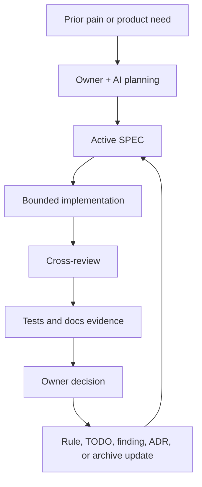

# SPEC-Driven AI Development

Owner-supervised, multi-agent, evidence-based software development with AI agents and living SPECs.

## Languages

English is the canonical documentation language for this repository.

- [English](README.md)
- [한국어](README.ko.md)
- [中文](README.zh.md)
- [日本語](README.ja.md)

Localized READMEs are orientation guides. If a localized guide conflicts with
the English docs, templates, or validation scripts, prefer the English canonical
files.

This repository packages a reusable workflow for people who use AI agents to plan, specify, implement, review, and maintain software while keeping a human owner in control of direction, risk, and completion decisions.

The workflow is field-derived from two anonymized project styles:

- Documentation-governance project control: documentation routing, source-of-truth order, active TODO/review ledgers, and production-readiness hardening.
- Release-governance project control: version lanes, migration maps, risk-domain rules, release gates, and cross-AI pre-release review.

## What This Is

This is not just "AI writes code from a spec."

It is a project-control loop:

```text
prior pain / product need
-> owner + AI planning
-> active SPEC
-> bounded implementation
-> cross-model review
-> tests and docs evidence
-> owner decision
-> operating rule or backlog update
```

The owner may not write code directly. The workflow is designed so the owner can still govern development through clear SPECs, small implementation slices, review findings, tests, documentation checks, and explicit acceptance decisions.

## Why This Exists

AI-assisted projects often fail in the same ways:

- every session starts from a different context,
- docs multiply until nobody knows what is current,
- AI claims completion without enough evidence,
- old plans override current code,
- reviewers find issues that never enter a durable backlog,
- non-coders cannot reliably supervise implementation progress.

This workflow turns those problems into a project control system.

## What's Included

```text
README.ko.md
README.zh.md
README.ja.md
prompts/
  kickoff-prompt.md
  review-prompt.md
  handoff-prompt.md
docs/
  pattern-catalog.md
  anti-patterns.md
  fit-assessment.md
  diagrams.md
  tool-adapters.md
  field-notes/
adapters/
  codex/
  claude-code/
  cursor/
  github-copilot/
  generic/
skills/
  ai-spec-project-start/
templates/
  project-control-files/
examples/
  minimal-project/
scripts/
  install-agent-adapter.ps1
  install-agent-adapter.sh
  install-codex-skill.ps1
  install-codex-skill.sh
  validate_repo.py
```

## Quick Start

Use the kickoff prompt in any capable AI coding environment:

```text
Use the SPEC-driven AI development workflow from this repository.
Start by clarifying the product pain, owner control model, active SPEC, non-goals, risks, and evidence required for completion.
```

Or open [prompts/kickoff-prompt.md](prompts/kickoff-prompt.md) and paste it into your AI session.

For the full method, read [docs/pattern-catalog.md](docs/pattern-catalog.md). For the field notes behind the method, read [docs/field-notes/documentation-governance-method.md](docs/field-notes/documentation-governance-method.md) and [docs/field-notes/release-governance-method.md](docs/field-notes/release-governance-method.md).

For the obvious-but-easy-to-miss rules, read [docs/implicit-rules.md](docs/implicit-rules.md).

For method hardening, read [docs/anti-patterns.md](docs/anti-patterns.md), [docs/fit-assessment.md](docs/fit-assessment.md), and [docs/diagrams.md](docs/diagrams.md).

## Install The Codex Skill

Windows PowerShell:

```powershell
.\scripts\install-codex-skill.ps1
```

macOS/Linux:

```bash
./scripts/install-codex-skill.sh
```

Then start a new Codex session and say:

```text
$ai-spec-project-start 사용해서 새 프로젝트 시작 구조 잡아줘.
```

If your session does not auto-discover newly installed skills yet, reference the skill path directly:

```text
Use the skill at ~/.codex/skills/ai-spec-project-start to bootstrap this project.
```

## Install Tool Adapters

Use adapters when you want the same SDAD rules in tools other than Codex.

PowerShell:

```powershell
.\scripts\install-agent-adapter.ps1 -Adapter claude-code -TargetPath C:\path\to\project
.\scripts\install-agent-adapter.ps1 -Adapter cursor -TargetPath C:\path\to\project
.\scripts\install-agent-adapter.ps1 -Adapter github-copilot -TargetPath C:\path\to\project
```

macOS/Linux:

```bash
./scripts/install-agent-adapter.sh claude-code /path/to/project
./scripts/install-agent-adapter.sh cursor /path/to/project
./scripts/install-agent-adapter.sh github-copilot /path/to/project
```

Available adapters:

- Codex: `AGENTS.md`
- Claude Code: `CLAUDE.md`
- Cursor: `.cursor/rules/spec-driven-ai-development.mdc`
- GitHub Copilot: `.github/copilot-instructions.md`
- Generic: `AI-SESSION-INSTRUCTIONS.md`

See [docs/tool-adapters.md](docs/tool-adapters.md).

## Use The Project Templates

Copy the files under [templates/project-control-files](templates/project-control-files) into a new project, then adapt them:

- `AGENTS.md`: mandatory AI agent start rules.
- `docs/INDEX.md`: single documentation routing table.
- `docs/Repository-Operating-Rules.md`: durable rulebook for repeated agent rules.
- `SPEC/SPEC-COMPLETE.md`: canonical current product and implementation baseline.
- `SPEC/adr/ADR-0001-template.md`: decision record template for durable rationale.
- `docs/TODO-Open-Items.md`: current open implementation work.
- `review-findings.md`: active bugs and review findings.
- `README.md`: human-facing project summary.

## Field-Proven Controls

Use documentation-governance controls when the problem is context drift, scattered docs, unclear completion status, or production-readiness uncertainty.

Use release-governance controls when the problem is stable-vs-next version management, migration risk, release packaging, platform differences, or fragile runtime behavior.

Most serious AI-assisted projects need both: documentation-governance controls keep the project intelligible across sessions, while release-governance gates keep risky releases and refactors honest.

## Implicit Rules

This workflow makes implicit rules explicit. The Core 5 are:

- Current active state beats historical SPEC material.
- Evidence beats AI confidence.
- Active scope beats interesting future ideas.
- Owner decision beats AI momentum.
- Repeated pain becomes a rule, checklist, test, or template update.

The Extended 15 cover larger-project risks such as docs drift, version lanes,
release readiness, partial/degraded behavior, environment limits, cross-review,
and risk gates.

## Visual Overview



More diagrams are in [docs/diagrams.md](docs/diagrams.md).

## Source Of Truth

When sources conflict, prefer:

1. Source code, migrations, tests, reproducible commands
2. Active runtime docs
3. Canonical SPEC
4. Active SPEC files
5. Handoff/save-state files
6. Product notes and external references
7. Historical or archived records
8. Chat memory or AI confidence

If a SPEC spans past-to-present history, current active sections override older
sections. Older SPEC material is rationale unless reaffirmed in the current
active path.

## AI Role Split

- Planning AI: turns owner pain into product scope and non-goals.
- SPEC AI: writes implementation-ready SPEC with acceptance criteria.
- Builder AI: implements a bounded slice.
- Reviewer AI: finds bugs, security risks, missing tests, docs drift, and overreach.
- QA AI: tries to reproduce behavior and verify commands.
- Maintainer AI: updates docs, TODO, findings, and handoff.
- Owner: sets direction, priority, risk tolerance, and final acceptance.

## Validate This Repository

```bash
python scripts/validate_repo.py
```

## License

MIT. See [LICENSE](LICENSE).
