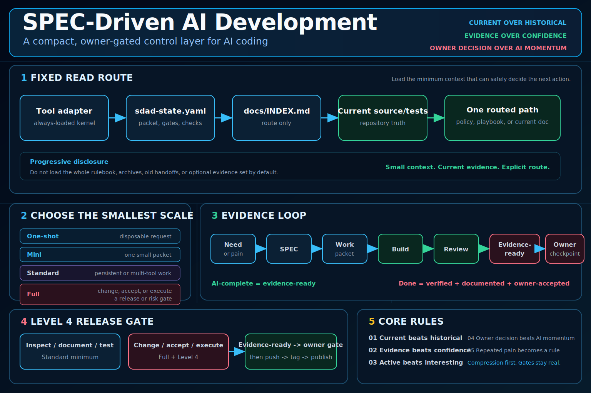
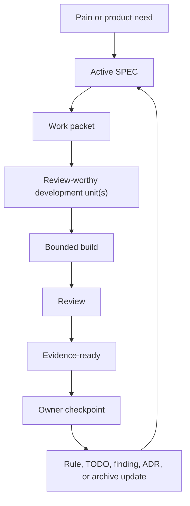

# SPEC-Driven AI Development

A control layer for AI coding: turn specs, agents, and outputs into a governed
development loop.

Status: `2.1.0` stable documentation/package release.

Effectiveness depends on project fit, owner discipline, and evidence quality.

Works with Codex, Claude Code, Cursor, Copilot Chat, and generic AI coding
agents.

**Start fast:** [User Guide](docs/user-guide.md) |
[Owner Guide](docs/owners-guide.md) |
[AI Work Loop](docs/ai-work-loop.md)

<p>
  <a href="https://github.com/sponsors/LiveTrack-X">
    
  </a>
  <a href="https://buymeacoffee.com/livetrack">
    
  </a>
</p>



## Start Here

If you are introducing SDAD to users or a team, start with
[docs/owners-guide.md](docs/owners-guide.md).

If an AI agent is already working and needs the shortest execution loop, use
[docs/ai-work-loop.md](docs/ai-work-loop.md).

If you are not sure what to do, start with
[docs/user-guide.md](docs/user-guide.md).
Localized versions:
[한국어](docs/user-guide.ko.md),
[中文](docs/user-guide.zh.md),
[日本語](docs/user-guide.ja.md).

It answers practical questions like:

- which scale to use: One-shot, Mini, Standard, or Full,
- what to type when you do not know SDAD terms or skill names,
- what to do when AI asks for approval too often,
- what to do when AI runs ahead too much,
- what context the AI should load now versus keep on demand,
- what evidence to require when AI says "done",
- when to use implementation notes, ADRs, save-state, or handoff.

The copy-paste prompt below is for running SDAD in an AI coding tool. The user
guide is the human-facing explanation.

## Copy-Paste Start Prompt

No terminal. No Git. No Python required.

The block below is an execution prompt for your AI coding tool. It is not the
main explanation of SDAD.

1. Open your project in an AI coding tool that can edit files, such as Codex,
   Claude Code, Cursor, or Copilot Chat.
2. Paste the text below.
3. Let the AI choose the scale and create only the files that scale needs.

<details>
<summary><strong>Show the full copy-paste prompt</strong></summary>

```text
Use SPEC-Driven AI Development (SDAD) as this project's control method.
Source: https://github.com/LiveTrack-X/spec-driven-ai-development

1. Confirm capability.
If this environment cannot edit the project filesystem, plan only. Do not
install files or claim they were saved. Tell me to continue in a file-editing AI
coding tool.

2. Choose the smallest scale before creating files. Ask:
- Will this take more than one AI session?
- Will the owner return later?
- Does done need evidence beyond AI confidence?
- Will multiple AI tools or reviewers be involved?
- Is there release, production, migration, destructive action, real user data,
  auth, money, security, rollback, or another owner-controlled risk?

Use One-shot for 0 yes. Use Mini for 1-2 yes from the first three questions only
when multi-tool and risk questions are no. Use Standard for multi-tool work,
three yes answers, or persistent control. A packet that only inspects,
documents, or tests a risk area is Standard minimum. Use Full when the packet
changes, accepts, or executes a production-facing, release, migration,
destructive, real-data, auth, money, security, or rollback gate.

3. Choose the tool: Codex, Claude Code, Cursor, Copilot Chat, or Generic.
Before fetching, state the chosen scale and adapter. Read the canonical
`install-sources.json` and matching route in
`docs/no-clone-quick-install.md`. Use its exact revision, path, target, and
SHA-256. Show the source and hash result before saving. Never invent an adapter
or use an unverified download. If fetching fails, stop and offer retry, pasted
source, terminal installer, or manual clone/download.

One-shot creates no files. Mini installs only the matching Mini instruction
file. Standard or Full installs exactly one tool adapter, then bootstraps the
project control files. Never overwrite an existing file without showing the
proposed change.

4. For Standard or Full, create and read the compact control plane first:
- `sdad-state.yaml`: scale, intensity, autonomy, active SPEC, active packet,
  owner gates, validation commands, and only the routed docs;
- `docs/INDEX.md`: trigger-to-file routing;
- current source/tests and only the files routed for this packet.

Do not load the full rulebook, archives, old handoffs, or optional evidence
templates by default. Open relevant rule headings on demand.

5. Choose execution posture.
Default Mini to Level 1 and Standard/Full implementation to Level 2 Work Packet
Autonomy. Use Level 4 owner gates for release, migration, destructive actions,
data/auth/money/security decisions, rollback, and production claims. Work
through review-worthy units without micro-approval.

Proceed until evidence-ready. Stop only when scope expands, a risk or claim gate
changes, an irreversible action is required, an owner-controlled tradeoff is
unresolved, verification is blocked, or evidence conflicts with the plan.
Evidence-ready and owner-accepted are separate states.

6. Protect context and data.
Sensitive data is an authorization boundary, not a size threshold. Use
metadata-only inspection by default for private or secret-bearing inputs.
Do not read or expose credentials, keys, tokens, cookies, `.env` contents, raw
customer records, or private corpora unless the task requires it and owner policy plus tool policy permit it. Use bounded reads for large files and search output.

7. Execute from current evidence.
Prefer source, tests, runtime state, and reproducible commands over stale docs
or chat memory. Record spec-unstated durable choices in implementation notes;
use an ADR only for a hard-to-reverse surprising tradeoff. Create optional
product evidence files only when the packet makes the corresponding product,
hardware, compatibility, package, remote, public, or release claim.

8. Finish compactly.
Run the routed validation commands. Report changed files, behavior, checks,
docs checked, open findings, unverified behavior, remaining risk, owner
decisions, acceptance status, and next step. Update save-state or handoff only
when work pauses, changes hands, remains blocked/partial/unverified, direction
changes, or reconstruction would be expensive.
```

</details>

Developers and terminal users can use the one-paste PowerShell/Bash installers
in [docs/no-clone-quick-install.md](docs/no-clone-quick-install.md).

The executable quick-start URLs pin a full 40-character commit SHA for a stable
baseline. A release tag is easier to read but can move unless repository policy
makes it immutable. Use `/main/` only when you explicitly want the latest,
unpinned instructions, and record the chosen revision in setup notes. See
[install-sources.json](install-sources.json) for the canonical revision/path/hash
contract and [docs/known-limitations.md](docs/known-limitations.md) for its limits.

## What SDAD Gives You

SDAD adds a project control layer around AI coding. It helps you:

- choose the right workflow scale before creating files,
- give each AI tool the correct instruction file,
- keep one current SPEC, TODO list, review ledger, and continuity state,
- separate always-loaded instructions, active control files, on-demand
  references, and archived evidence,
- route natural-language requests into the right SDAD mode without requiring
  users to know exact skill names,
- require evidence before accepting AI completion claims,
- use before/after change checks so autonomy stays auditable,
- record important spec-unstated implementation decisions,
- move repeated mistakes into rules, tests, templates, or review gates.

Use [docs/user-guide.md](docs/user-guide.md) when you want the human-facing
explanation of what to do in common situations, including troubleshooting such
as "the AI asks for approval too often" or "the AI says done without evidence".
Use the copy-paste prompt above when you want an AI coding agent to set SDAD up
for a project.

## How SDAD Organizes Context

SDAD treats context as an operating surface, not a pile of files to load at
once.

| Context layer | Examples | Rule |
|---|---|---|
| Always-loaded kernel | `AGENTS.md`, `CLAUDE.md`, Cursor or Copilot rules | Self-contained safety, source/evidence, autonomy, and stop rules. |
| Active route | `sdad-state.yaml`, then `docs/INDEX.md` | Name the current packet, gates, checks, and one routed path. |
| Routed current state | active SPEC, TODO, findings, implementation notes | Load only when the packet route needs it. |
| On-demand policy/procedure | operating-rule heading, one `docs/sdad/playbooks/` file, field notes | Load only for the matching trigger. |
| Archive and evidence | old handoffs, logs, generated reports, historical notes | Reference by path or bounded read; do not flood chat context. |

This keeps the AI oriented without turning every session into a full repository
transcript.

SDAD also separates guidance from guarantees. Guidance belongs in adapter files,
routed rules, playbooks, and review prompts. Non-negotiable behavior belongs in
enforced surfaces such as CI, validators, hooks, permissions, deny rules,
release gates, or required checks. Secrets, destructive actions, migrations,
production deploys, release artifacts, and money/data/security boundaries should
not rely on Markdown reminders alone.

For the SDAD abstraction of this repository-structure pattern, see
[docs/field-notes/repository-control-surface-method.md](docs/field-notes/repository-control-surface-method.md).
That pattern includes a report-first control surface checkup for stale or
duplicated skills, MCPs, plugins, hooks, permissions, local instructions, and
tool versions. Applying those changes still requires the matching owner gate.

## Natural-Language Intent Routing

Users should not need to memorize SDAD terms, adapter names, or skill names.
When the user's wording is clear enough, the AI should infer the work intent
from the sentence and current repository state, then choose the smallest SDAD
route that protects scope, evidence, and owner gates.

| User says something like | Interpret as | Route |
|---|---|---|
| "Check if anything is wrong", "review this", "find bugs" | Review or audit intent | Inspect current evidence, findings, tests, and relevant code before recommending fixes. |
| "Implement this", "make it match the spec", "fix it" | SPEC implementation intent | Identify the active SPEC or owner request, define the packet, then implement within autonomy limits. |
| "Release it", "publish it", "tag it" | Release intent | Keep Level 4 gates for release, production claims, rollback, migration, and owner risk acceptance. |
| "The docs are confusing", "write a guide", "explain usage" | Documentation intent | Update user-facing docs and check routing/index consistency. |
| "Continue later", "handoff", "next session lost context" | Handoff intent | Update save-state or create a session handoff with current evidence and next steps. |
| "Can we borrow from this project?", "rebuild this from the old app" | Reference-intake intent | Evaluate fit, adapt compatible patterns, avoid wholesale workflow transplant, and run a Reference Parity Review Gate before evidence-ready. |
| "It asks too much", "it runs ahead" | Autonomy tuning intent | Adjust autonomy level, packet boundary, and operating intensity without bypassing risk gates. |

Treat narrative modifiers as routing signals, not automatic scope expansion.
"Carefully", "thoroughly", or "audit the whole flow" increases inspection depth
inside the current scope; it does not authorize unrelated refactors. "Fully" or
"end-to-end" means continue to evidence-ready for the approved scope and stop at
owner gates; it does not mean owner-accepted. "Quickly", "lightly", or "minimal"
selects compression, not weaker evidence. "Commit and wait" does not imply push,
release, or deploy unless those are named.

If multiple intents match, first decide whether they can be safely composed
inside one approved packet. If one route remains dominant, proceed and state the
interpretation briefly. If the combination changes scope, risk, claim level,
owner gate, or durable-doc requirements, ask one blocking clarification question
with a recommended default. Natural-language routing is not permission to read
everything; it should still use the context layers above.

## Reference Parity Review

When a packet is derived from an existing product, repository, design, demo, or
field project, evidence-ready requires a small reference parity check:

```text
source behavior -> implemented behavior -> evidence -> gap/deferred claim
```

This is not permission to clone the old implementation. It is a guard against
thin rebuilds that pass basic tests while losing reference-critical workflows,
state labels, role boundaries, live-state behavior, or visible product controls.
For UI/product work, screenshot review can be evidence. For server, package,
hardware, or deployment work, keep test runtime, live runtime, and persisted
state as separate evidence tiers.

## Evidence Tiers And Claims

Evidence tier decides claim scope:

| Evidence | Can support | Cannot support alone |
|---|---|---|
| local test | code behavior, regression, CLI or contract checks | browser UI, live runtime, persisted state, hardware, production |
| browser render | visible UI, interaction, screenshot-reviewed product controls | backend correctness, persisted state, deployment safety |
| live runtime | real local/dev process and dependency behavior | restart durability, remote compatibility, production readiness |
| persisted state | reload/restart/import/export state claims | live hardware, all environments, production rollout |
| remote hardware | named device/tester/lab evidence after review | all devices, production readiness, owner acceptance |
| production evidence | deployed/package/release/rollback claims for a named environment | broader scope than the observed environment or owner acceptance |

Use the weakest public claim supported by the evidence. Do not upgrade a claim
because a lower tier passed or because a remote bundle arrived unreviewed.
No evidence tier grants owner acceptance without the owner checkpoint or a
delegated acceptance policy.

## Use It When

| Situation | Start with |
|---|---|
| One disposable request, no future context needed | One-shot prompt |
| Small task, but evidence or a tiny handoff matters | Mini SDAD |
| Multi-session project, review findings, or durable TODOs | Standard SDAD |
| A release, migration, production, user-data, auth, money, security, or rollback area is only inspected, documented, or tested | Standard SDAD minimum with explicit risk tracking |
| The packet changes, accepts, or executes one of those gates | Full SDAD with Level 4 owner gates |
| Chat-only tool with no project files | Planning only; install later in a file-editing AI coding tool |
| AI says "done" | Ask for evidence-ready status, changed files, checks, docs checked, limits, and owner acceptance |
| AI asks approval after every micro-task, or runs ahead too much | Pick the matching autonomy level and packet boundary; do not bypass risk gates |

## Languages

English is the canonical documentation language for this repository.

- [English](README.md)
- [한국어](README.ko.md)
- [中文](README.zh.md)
- [日本語](README.ja.md)

Localized READMEs are orientation guides. If a localized guide conflicts with
the English docs, templates, or validation scripts, prefer the English canonical
files.

## Choose Scale First

Before installing anything, answer these:

1. Will this take more than one AI session?
2. Will you come back to this project later?
3. Does "done" need evidence beyond "AI said so"?
4. Will multiple AI tools or reviewers be involved?
5. Is there release, migration, real user data, auth, money, security, rollback,
   destructive action, or production risk?

Choose the smallest scale that fits:

Override rules beat raw yes-counts:

| Trigger | Use | Creates |
|---|---|---|
| 0 yes | One-shot prompt | No project files |
| 1-2 yes from Q1-Q3 only, with Q4=no and Q5=no | Mini SDAD | One instruction file |
| Q4=yes or 3 yes total | Standard SDAD | Core control files |
| Q5=yes, but the packet only inspects, documents, or tests the risk area | Standard SDAD minimum | Core control files and explicit risk tracking |
| Q5=yes and the packet changes, accepts, or executes the gate | Full SDAD | Full workflow, review, conditional ADRs, gates |
| 4-5 yes | Full SDAD | Full workflow, review, conditional ADRs, active gates |

When unsure, choose the smaller scale only if no Q5 gate is active. Escalate
when repeated pain, context loss, risk, or multiple sessions appear.

Small project? Start with [Mini SDAD](docs/mini-sdad.md), not the full workflow.

## Maintenance Cost

SDAD files are not write-once setup files.

If you choose Standard or Full SDAD, every work packet or handoff must end by
checking and updating the control files:

- `SPEC/SPEC-COMPLETE.md`,
- `docs/TODO-Open-Items.md`,
- `review-findings.md`,
- `docs/implementation-notes.md` when implementation made a spec-unstated
  assumption, change, compromise, or tradeoff,
- operating rules or ADRs when decisions or repeated pain changed,
- `save-state.md` when a session pauses or ends, handoff is expected, owner
  direction changes, blocked/partial/unverified state remains, or context would
  be expensive to reconstruct.

Keep active live-state files short enough to read as current operating state.
If `save-state.md`, `docs/TODO-Open-Items.md`, `review-findings.md`, or similar
files become long journals, preserve the old material in archive/history files
and keep the active file focused on current objective, open items, constraints,
validation state, next one to three steps, and archive links. Use bounded reads
for large archives, logs, generated artifacts, and authorized private data. See
[docs/context-stability.md](docs/context-stability.md).
If graphing, repo-packing, embedding, indexing, or context-building tools are
used, keep their ignore files aligned so generated, private, log, cache,
dependency, and local database surfaces do not enter AI context by default.

If no file needs a content change, the handoff must say which files were checked
and why no update was needed. Do not claim completion while control files are stale.

Mini SDAD also has a completion gate: changed files, checks or manual proof, and
limitations must be shown before a slice is called evidence-ready. Owner
acceptance is still required before final done unless the owner delegates that
acceptance policy.

Small Project Compression Rule: for One-shot, Mini SDAD, or a small Standard
packet, one evidence-ready summary is enough when there is one active slice, no
Q5 gate changed, no unresolved finding must survive, no durable spec-unstated
decision exists, and no handoff is expected. Create or update SPEC, TODO,
review-findings, implementation notes, save-state, handoff, Evidence Matrix,
Claim Registry, or Artifact Contract only when that surface has an active job.

If that cost is too high, choose One-shot Prompt or [Mini SDAD](docs/mini-sdad.md).
See [docs/maintenance-cost.md](docs/maintenance-cost.md).

## Operating Intensity

Standard and Full SDAD can run at different operating intensities:

```text
Standard SDAD / High
Standard SDAD / Medium
Standard SDAD / Low
Full SDAD / High
Full SDAD / Medium
Full SDAD / Low
```

`Mini / Standard / Full SDAD` are project scales. `High / Medium / Low` are
operating intensities inside Standard and Full, not new scales or autonomy
levels. Use `Standard SDAD / High` for a non-Q5 packet with a major product or
architecture tradeoff, a hard-to-reverse implementation choice, or an explicit
owner checkpoint. Q5 projects do not make every packet High. Use
`Full SDAD / High` when the current packet changes behavior, policy, boundary,
evidence claim, or risk acceptance for a Q5 gate: release, production,
migration, auth, data, money, security, rollback, destructive action,
accepted-memory boundary, external deployment, or major owner-controlled risk
decision.

The purpose of SDAD is not to create more control files. The purpose is to keep
the project controllable. When control surfaces reduce controllability, lower
intensity, freeze the baseline, compress evidence, and simplify owner review.
See [docs/operating-intensity.md](docs/operating-intensity.md).

## Cost-Aware Agent Routing

SDAD can use stronger models, advisor passes, parallel workers, and automated
loops, but only when the route protects evidence, cost, or owner risk. Start
with lean execution: act when repository evidence is enough, use the simplest
solution, report only evidenced claims, pause only for real owner gates, and
lead with the outcome.

Escalate deliberately:

- Executor-Advisor: one executor does the work and consults a stronger advisor
  for hard judgments, conflicts, repeated failure, or pre-completion review.
- Orchestrator-Worker: one orchestrator splits independent units into workers
  with explicit boundaries, output contracts, and evidence requirements.
- Loop Engineering: turn-based, goal-based, time-based, or event-based loops
  run only with a trigger, done condition, budget, stop rule, evidence
  contract, owner gate, and state surface.

Advisor approval, worker completion, and a passing loop evaluator are
evidence-ready signals, not owner acceptance. See
[docs/field-notes/cost-aware-agent-routing-method.md](docs/field-notes/cost-aware-agent-routing-method.md).

## Advanced Extension Fit

Harness optimization, self-improving loops, retrieval or memory tuning, and
repeated evaluation automation are optional extensions, not default SDAD loops.
Use them only when the project has a repeated task unit, measurable success
metric, fixed model/tool surface, bounded allowed changes, leakage-risk plan,
concrete budget, and owner adoption gate. For harness optimization, also name
the harness interface, baseline harness, search/held-out split, offline traces,
online candidate traces, and candidate adoption path.

Each fit-gate field should be answered, marked `unknown`, or marked `blocking`.
Do not treat a discovered prompt, rule, retrieval policy, memory policy, or
harness as owner-accepted until the owner reviews the evaluation split, leakage
risk, budget result, changed behavior, and adoption plan.

See [docs/fit-assessment.md](docs/fit-assessment.md) and
[docs/anti-patterns.md](docs/anti-patterns.md). For the SDAD abstraction of
Meta-Harness, see
[docs/field-notes/meta-harness-method.md](docs/field-notes/meta-harness-method.md).

## Work Packets And Autonomy Levels

SDAD should not stop after every micro-task. Too many owner checkpoints create
approval fatigue and make the workflow harder to use.

Use [docs/autonomy-levels.md](docs/autonomy-levels.md) to choose how much the AI
may do before asking again.

Default:

- Mini SDAD: Level 1 Unit Autonomy, treated as one small approved packet.
- Standard SDAD: Level 2 Work Packet Autonomy.
- Full SDAD or Q5 risk: Level 2 for implementation, with Level 4 release/risk
  gates.

A work packet is a bounded container for one or more review-worthy development
units. The owner approves the packet boundary, not every small task inside it.
Do not use individual SPEC checklist items as owner-approval boundaries by
default.

Before implementation, define a review-worthy development unit:

- one user-visible workflow,
- one bugfix with its regression check,
- one connected docs/template/prompt update,
- one risk-domain hardening pass,
- or one small feature path from behavior to evidence.

Each unit may include multiple related TODOs. Units help organize review and
evidence; they do not require separate owner approval while they stay inside the
approved packet. The AI should continue inside the approved work packet and hand
off when the packet has changed files, checks, known limits, and reviewable
evidence.

Use two states:

- `AI-complete / evidence-ready`: changed files, checks, docs checked, limits,
  and risks are shown.
- `Owner-accepted`: the owner accepts, rejects, revises, or defers at a
  checkpoint.

Evidence-ready units may continue inside the approved packet. Final completion
requires owner acceptance or an explicitly delegated acceptance policy.

Ask the owner only when:

- scope would expand beyond the approved packet,
- Q5 risk, release posture, data, auth, money, migration, or destructive action
  changes,
- a tradeoff belongs to the owner,
- verification is blocked or impossible,
- current evidence conflicts with the requested plan.

## Why SDAD Exists

New to the workflow? Start with [docs/user-guide.md](docs/user-guide.md).

[docs/getting-started.md](docs/getting-started.md) then shows practical setup
paths:

- common-situation FAQ,
- scale selection,
- no-clone quick install,
- Mini SDAD for small projects,
- maintenance cost and loop-end updates,
- prompt-only start,
- install a tool adapter into an existing project,
- install the Codex skill.

The goal is to choose the right scale first, then create only the control files
that scale needs.

## The Problem

AI coding feels solved.

But projects still break:

- specs drift from code,
- AI says "done" but bugs remain,
- context resets every session,
- docs become unreliable,
- old plans override current work,
- no one knows the real source of truth.

The hard part is no longer getting AI to produce code. The hard part is keeping
AI-assisted development governed, current, reviewed, and evidence-based.

## What This Is

This is not another spec template.

SPEC-Driven AI Development is a control system for AI-driven development. It
enforces:

- owner-supervised development,
- spec-driven execution,
- multi-agent verification,
- evidence-based completion,
- current-over-historical source of truth,
- repeated-pain-to-rule learning.

It is designed for projects where AI agents help plan, specify, implement,
review, test, document, and hand off work while a human owner keeps direction,
risk tolerance, and final acceptance.

## Core Idea

AI writes code.

The owner controls the system.

Completion is not decided by AI. Completion is decided by evidence:

- code changed,
- tests or checks ran,
- docs were checked or updated,
- review findings are known,
- risks are named,
- the owner accepts the result.

Inside an approved work packet, AI autonomy is guarded by implementation
discipline: surface assumptions, keep the design simple, make surgical changes,
tie every step to verification, and record spec-unstated implementation
decisions in implementation notes.
When the plan is fuzzy, SDAD adds a clarification checkpoint: inspect repository
evidence first, ask only the next blocking owner question, include the AI's
recommended answer, and route the resolved decision to SPEC, implementation
notes, ADR, TODO, review finding, or handoff.

## The Loop

These are three views of one routine, not competing procedures: the control
spine names the gates, the execution routine names the working order, and the
pain loop names the feedback cycle.

The full control spine is:

```text
Scale/compress -> Active SPEC slice -> Work packet -> Evidence tier/gates -> Owner checkpoint -> Maintenance
```

The fixed read route is:

```text
Adapter -> sdad-state.yaml -> docs/INDEX.md -> source/tests -> one routed path
```

In an installed SDAD project, `sdad-state.yaml` holds current packet state and
`docs/INDEX.md` selects the next file. The installable templates live under
`templates/project-control-files/`. Do not load the full rulebook, archives,
old handoffs, or optional evidence set by default. ADRs, evidence maps, claim
registries, save-state, and handoffs exist only when their trigger exists.

Scale and compression happen before creating files. Reference parity and
evidence-tier checks happen before evidence-ready. ADRs are conditional: create
one only when a decision is hard to reverse, surprising without context, and a
real tradeoff.

```text
Pain -> SPEC -> Work packet -> Review-worthy unit(s) -> Build -> Review -> Evidence-ready -> Owner checkpoint -> Rule
```

This loop repeats every iteration. The goal is not only to fix problems, but to
turn repeated problems into durable rules, templates, tests, or review gates.
When implementation requires a judgment the SPEC did not cover, that judgment
becomes implementation memory in `docs/implementation-notes.md`, not a hidden
chat assumption.



## Why This Is Different

Most workflows:

```text
AI + developer
```

This workflow:

```text
AI + owner
```

The owner may be a developer, but does not have to be one. The system is built
so a non-coding owner can still supervise scope, evidence, risk, and acceptance.

Most workflows:

```text
"AI says done"
```

This workflow:

```text
AI-complete = evidence-ready
Done = verified + documented + accepted
```

Most workflows fix problems.

This workflow turns problems into rules.

## Project Bootstrap Reference

Use the single copy-paste prompt in [Start Here](#start-here). A local checkout
contains the compact state -> INDEX -> on-demand templates. The current pinned
v2.1.0 no-clone manifest declares `progressive_control_plane=false`; follow its
installed baseline rather than claiming that Unreleased route is present. A
future release pin can enable it after the adapters and hashes are committed.

For step-by-step setup, use [docs/getting-started.md](docs/getting-started.md).
For no-clone setup, use [docs/no-clone-quick-install.md](docs/no-clone-quick-install.md).
For a fuller kickoff prompt, use [prompts/kickoff-prompt.md](prompts/kickoff-prompt.md).

## Project Structure

The first instruction file is tool-specific. Do not create all of them; install
the one that matches your AI coding tool.

```text
AI instruction file, choose one:
  AGENTS.md                                      # Codex
  CLAUDE.md                                      # Claude Code
  .cursor/rules/spec-driven-ai-development.mdc   # Cursor
  .github/copilot-instructions.md                # GitHub Copilot
  AI-SESSION-INSTRUCTIONS.md                     # generic AI agent

sdad-state.yaml                                  # current packet, gates, checks, routed docs
docs/INDEX.md                                    # working router for active docs
docs/Repository-Operating-Rules.md               # durable operating rules
docs/sdad/playbooks/                             # on-demand procedures by trigger
docs/implementation-notes.md                     # spec-unstated implementation decisions
docs/domain-language.md                          # optional glossary when terminology drift affects execution
SPEC/SPEC-COMPLETE.md                            # current product and implementation truth
SPEC/adr/                                        # durable decision records
docs/TODO-Open-Items.md                          # active implementation work
review-findings.md                               # active bugs and review findings
save-state.md                                    # optional session recovery state
docs/sdad/handoffs/                              # session handoffs for fresh starts
docs/archive/                                    # historical material outside startup path
```

Templates live in [templates/project-control-files](templates/project-control-files).

## Tool Adapters

Use adapters when you want the same control layer in different AI coding tools:

- Codex: `AGENTS.md` + `ai-spec-project-start` skill
- Claude Code: `CLAUDE.md`
- Cursor: `.cursor/rules/spec-driven-ai-development.mdc`
- GitHub Copilot: `.github/copilot-instructions.md`
- Generic AI tool: `AI-SESSION-INSTRUCTIONS.md`

Install examples:

```powershell
.\scripts\install-agent-adapter.ps1 -Adapter claude-code -TargetPath C:\path\to\project
.\scripts\install-agent-adapter.ps1 -Adapter cursor -TargetPath C:\path\to\project
.\scripts\install-agent-adapter.ps1 -Adapter github-copilot -TargetPath C:\path\to\project
```

See [docs/tool-adapters.md](docs/tool-adapters.md).

## Codex Skill

Install the Codex skill:

```powershell
.\scripts\install-codex-skill.ps1
```

macOS/Linux:

```bash
./scripts/install-codex-skill.sh
```

If your checkout lost executable bits, use `bash ./scripts/install-codex-skill.sh`.

Existing skill installs are preserved by default. After reviewing local
changes, use `-Force` in PowerShell or `--force` in Bash for a staged,
verified replacement.

Then start a new Codex session and say:

```text
$ai-spec-project-start use this workflow to bootstrap my project.
```

## Who This Is For

- solo builders using AI coding tools,
- non-coders supervising AI development,
- technical owners coordinating multiple AI sessions,
- projects suffering from context loss or spec drift,
- projects where "done" must mean verified and accepted,
- teams that want repeated failures to become durable rules.

Use [docs/fit-assessment.md](docs/fit-assessment.md) if you are not sure the
workflow fits your project.

## What This Is Not

- Not a coding framework.
- Not a prompt collection.
- Not an autonomous agent system.
- Not a replacement for tests or reviews.
- Not a guarantee that AI output is correct.
- Not a reason to skip owner decisions.
- Not permission for speculative abstractions, drive-by refactors, or unrelated
  cleanup.

## Core Rules

The Core 5:

- Current beats historical.
- Evidence beats confidence.
- Active beats interesting.
- Owner decision beats AI momentum.
- Repeated pain becomes a rule.

The Extended Rules cover repository-evidence-first clarification, stable domain
language, docs drift, partial or degraded work, version lanes, release
readiness, environment limits, cross-review, risk gates, and implementation
memory.

See [docs/implicit-rules.md](docs/implicit-rules.md).

## Key Docs

- [docs/pattern-catalog.md](docs/pattern-catalog.md): full method and pattern matrix
- [docs/owners-guide.md](docs/owners-guide.md): quick owner rollout guide for getting users productive
- [docs/ai-work-loop.md](docs/ai-work-loop.md): short Fast/Normal/Full execution loop for AI agents
- [docs/user-guide.md](docs/user-guide.md): situation-based user guide and FAQ
- [docs/getting-started.md](docs/getting-started.md): first-use setup guide
- `docs/INDEX.md` in each SDAD project: working router for which active doc to check at each moment
- [docs/no-clone-quick-install.md](docs/no-clone-quick-install.md): copy-paste setup without cloning
- [docs/anti-patterns.md](docs/anti-patterns.md): failure modes to avoid
- [docs/fit-assessment.md](docs/fit-assessment.md): project fit checklist
- [docs/maintenance-cost.md](docs/maintenance-cost.md): loop-end control file update cost, documentation routine order, and documentation record audit
- [docs/context-stability.md](docs/context-stability.md): bounded reads and live-state slimming
- [docs/operating-intensity.md](docs/operating-intensity.md): Standard/Full High, Medium, and Low operating intensity
- [docs/session-handoff.md](docs/session-handoff.md): long-session handoff and context continuity
- [docs/autonomy-levels.md](docs/autonomy-levels.md): work packets and low-intervention autonomy
- [docs/implementation-discipline.md](docs/implementation-discipline.md): assumptions, simplicity, surgical diffs, and verification
- [docs/implementation-notes.md](docs/implementation-notes.md): bounded decision log for spec-unstated implementation choices
- [docs/product-evidence-templates.md](docs/product-evidence-templates.md): optional Evidence Matrix, Claim Registry, Artifact Contract, Work Packet State, and Remote Evidence Import templates for product/hardware claims
- [docs/diagrams.md](docs/diagrams.md): workflow diagrams
- [docs/tool-adapters.md](docs/tool-adapters.md): tool-specific instruction files
- [docs/field-notes/repository-control-surface-method.md](docs/field-notes/repository-control-surface-method.md): guidance, enforcement, isolation, and reviewed-memory control surfaces
- [docs/field-notes/cost-aware-agent-routing-method.md](docs/field-notes/cost-aware-agent-routing-method.md): advisor, worker, loop, cost, and evidence routing
- [docs/field-notes/documentation-governance-method.md](docs/field-notes/documentation-governance-method.md): documentation-governance field pattern
- [docs/field-notes/working-order-field-test.md](docs/field-notes/working-order-field-test.md): multi-agent disposable-project test of the SDAD working order
- [docs/field-notes/release-governance-method.md](docs/field-notes/release-governance-method.md): release-governance field pattern
- [docs/field-notes/meta-harness-method.md](docs/field-notes/meta-harness-method.md): harness optimization fit gate and evidence boundary pattern
- [docs/known-limitations.md](docs/known-limitations.md): adoption limits, raw URL pinning, validator scope, and installer smoke-test boundaries
- [SECURITY.md](SECURITY.md): security reporting path and security-boundary policy

## Validate

Automated repository tests live under `tests/`; do not create a separate
`test/` tree. Use Python 3.10 or newer.

```bash
python scripts/validate_repo.py
python -m unittest discover -s tests -v
git diff --check
```

## License

MIT. See [LICENSE](LICENSE).
