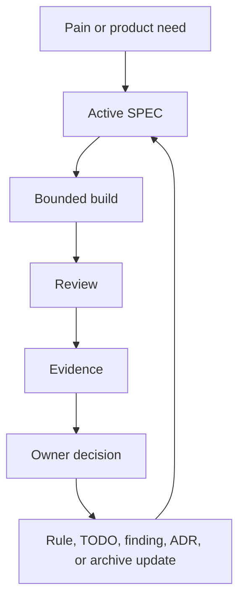

# SPEC-Driven AI Development

A control layer for AI coding: turn specs, agents, and outputs into a governed
development loop.

Status: `1.0.0` stable public release.

Works with Codex, Claude Code, Cursor, Copilot Chat, and generic AI coding
agents.

<p>
  <a href="https://buymeacoffee.com/livetrack">
    
  </a>
</p>

## For Beginners: Use In 60 Seconds

No terminal. No Git. No Python. No Codex skill required.

1. Open your project in an AI coding tool such as Codex, Claude Code, Cursor, or
   Copilot Chat.
2. Paste the text below.
3. Let the AI create the first SPEC and project control files.

If you do not know what a "Codex skill" is, ignore it for now. It is only an
optional convenience for Codex users.

```text
Use SPEC-Driven AI Development as the project control method.

Source:
https://github.com/LiveTrack-X/spec-driven-ai-development

No clone required. Install the matching adapter into this project, then
bootstrap the first active SPEC slice and project control files.

Ask me for product pain, smallest useful version, non-goals, risks,
owner-controlled decisions, and evidence required for completion.

Do not overwrite existing files without showing me the proposed changes.
Completion requires evidence, not AI confidence.
```

Developers and terminal users can use the one-paste PowerShell/Bash installers
in [docs/no-clone-quick-install.md](docs/no-clone-quick-install.md).

## Languages

English is the canonical documentation language for this repository.

- [English](README.md)
- [한국어](README.ko.md)
- [中文](README.zh.md)
- [日本語](README.ja.md)

Localized READMEs are orientation guides. If a localized guide conflicts with
the English docs, templates, or validation scripts, prefer the English canonical
files.

## Start Here

New to the workflow? Start with [docs/getting-started.md](docs/getting-started.md).

It shows practical paths:

- no-clone quick install,
- prompt-only start,
- install a tool adapter into an existing project,
- install the Codex skill.

The goal is to get a first active SPEC slice, project control files, and a clear
evidence checklist in the first session.

## The Problem

AI coding feels solved.

But projects still break:

- specs drift from code,
- AI says "done" but bugs remain,
- context resets every session,
- docs become unreliable,
- old plans override current work,
- no one knows the real source of truth.

The hard part is no longer getting AI to produce code. The hard part is keeping
AI-assisted development governed, current, reviewed, and evidence-based.

## What This Is

This is not another spec template.

SPEC-Driven AI Development is a control system for AI-driven development. It
enforces:

- owner-supervised development,
- spec-driven execution,
- multi-agent verification,
- evidence-based completion,
- current-over-historical source of truth,
- repeated-pain-to-rule learning.

It is designed for projects where AI agents help plan, specify, implement,
review, test, document, and hand off work while a human owner keeps direction,
risk tolerance, and final acceptance.

## Core Idea

AI writes code.

The owner controls the system.

Completion is not decided by AI. Completion is decided by evidence:

- code changed,
- tests or checks ran,
- docs were checked or updated,
- review findings are known,
- risks are named,
- the owner accepts the result.

## The Loop

```text
Pain -> SPEC -> Build -> Review -> Evidence -> Owner decision -> Rule
```

This loop repeats every iteration. The goal is not only to fix problems, but to
turn repeated problems into durable rules, templates, tests, or review gates.



## Why This Is Different

Most workflows:

```text
AI + developer
```

This workflow:

```text
AI + owner
```

The owner may be a developer, but does not have to be one. The system is built
so a non-coding owner can still supervise scope, evidence, risk, and acceptance.

Most workflows:

```text
"AI says done"
```

This workflow:

```text
Done = verified + documented + accepted
```

Most workflows fix problems.

This workflow turns problems into rules.

## Quick Usage

Fastest possible start:

```text
Use the SPEC-driven AI development workflow from this repository.
Extract my control model and create the first active SPEC slice.
```

Then follow the loop:

```text
Pain -> SPEC -> Build -> Review -> Evidence -> Owner decision -> Rule
```

For step-by-step setup, use [docs/getting-started.md](docs/getting-started.md).
For no-clone setup, use [docs/no-clone-quick-install.md](docs/no-clone-quick-install.md).
For a fuller kickoff prompt, use [prompts/kickoff-prompt.md](prompts/kickoff-prompt.md).

## Project Structure

```text
AGENTS.md                         # how AI agents behave
docs/INDEX.md                     # documentation navigation
docs/Repository-Operating-Rules.md # durable operating rules
SPEC/SPEC-COMPLETE.md             # current product and implementation truth
SPEC/adr/                         # durable decision records
docs/TODO-Open-Items.md           # active implementation work
review-findings.md                # active bugs and review findings
save-state.md                     # optional session recovery handoff
```

Templates live in [templates/project-control-files](templates/project-control-files).

## Tool Adapters

Use adapters when you want the same control layer in different AI coding tools:

- Codex: `AGENTS.md` + `ai-spec-project-start` skill
- Claude Code: `CLAUDE.md`
- Cursor: `.cursor/rules/spec-driven-ai-development.mdc`
- GitHub Copilot: `.github/copilot-instructions.md`
- Generic AI tool: `AI-SESSION-INSTRUCTIONS.md`

Install examples:

```powershell
.\scripts\install-agent-adapter.ps1 -Adapter claude-code -TargetPath C:\path\to\project
.\scripts\install-agent-adapter.ps1 -Adapter cursor -TargetPath C:\path\to\project
.\scripts\install-agent-adapter.ps1 -Adapter github-copilot -TargetPath C:\path\to\project
```

See [docs/tool-adapters.md](docs/tool-adapters.md).

## Codex Skill

Install the Codex skill:

```powershell
.\scripts\install-codex-skill.ps1
```

macOS/Linux:

```bash
./scripts/install-codex-skill.sh
```

Then start a new Codex session and say:

```text
$ai-spec-project-start use this workflow to bootstrap my project.
```

## Who This Is For

- solo builders using AI coding tools,
- non-coders supervising AI development,
- technical owners coordinating multiple AI sessions,
- projects suffering from context loss or spec drift,
- projects where "done" must mean verified and accepted,
- teams that want repeated failures to become durable rules.

Use [docs/fit-assessment.md](docs/fit-assessment.md) if you are not sure the
workflow fits your project.

## What This Is Not

- Not a coding framework.
- Not a prompt collection.
- Not an autonomous agent system.
- Not a replacement for tests or reviews.
- Not a guarantee that AI output is correct.
- Not a reason to skip owner decisions.

## Core Rules

The Core 5:

- Current beats historical.
- Evidence beats confidence.
- Active beats interesting.
- Owner decision beats AI momentum.
- Repeated pain becomes a rule.

The Extended 15 cover docs drift, partial or degraded work, version lanes,
release readiness, environment limits, cross-review, and risk gates.

See [docs/implicit-rules.md](docs/implicit-rules.md).

## Key Docs

- [docs/pattern-catalog.md](docs/pattern-catalog.md): full method and pattern matrix
- [docs/getting-started.md](docs/getting-started.md): first-use setup guide
- [docs/no-clone-quick-install.md](docs/no-clone-quick-install.md): copy-paste setup without cloning
- [docs/anti-patterns.md](docs/anti-patterns.md): failure modes to avoid
- [docs/fit-assessment.md](docs/fit-assessment.md): project fit checklist
- [docs/diagrams.md](docs/diagrams.md): workflow diagrams
- [docs/tool-adapters.md](docs/tool-adapters.md): tool-specific instruction files
- [docs/field-notes/documentation-governance-method.md](docs/field-notes/documentation-governance-method.md): documentation-governance field pattern
- [docs/field-notes/release-governance-method.md](docs/field-notes/release-governance-method.md): release-governance field pattern

## Validate

```bash
python scripts/validate_repo.py
```

## License

MIT. See [LICENSE](LICENSE).
