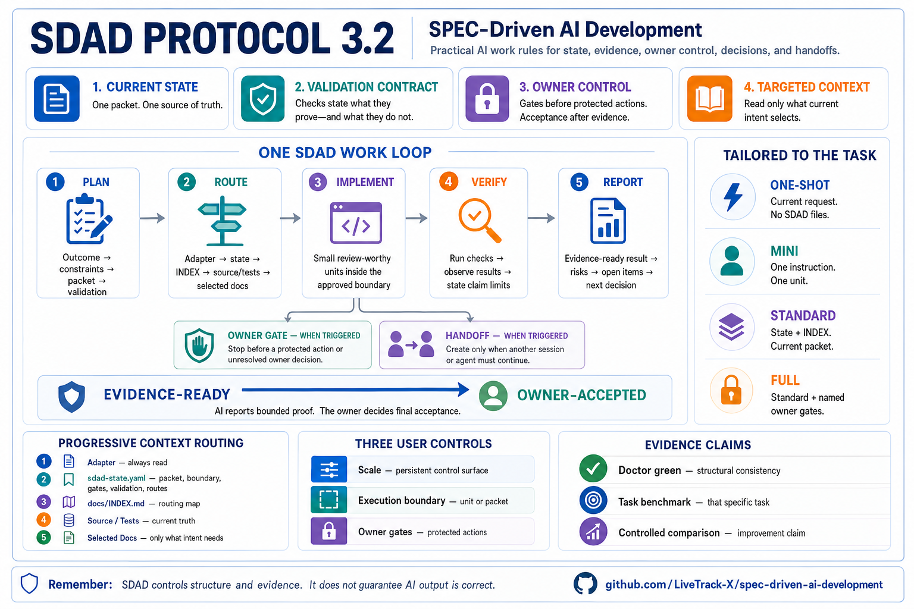

# SDAD Protocol

SPEC-Driven AI Development: a repository-local operating protocol for state,
evidence, owner control, decisions, and handoffs across coding agents and
sessions.

Status: `3.1.0` stable documentation/package release.

Effectiveness depends on project fit, owner discipline, and evidence quality.

Works with Codex, Claude Code, Gemini CLI, Cursor, Copilot Chat, and generic AI
coding agents.

**Start fast:** [User Guide](docs/user-guide.md) |
[Owner Guide](docs/owners-guide.md) |
[AI Work Loop](docs/ai-work-loop.md)

<p>
  <a href="https://github.com/sponsors/LiveTrack-X">
    
  </a>
  <a href="https://buymeacoffee.com/livetrack">
    
  </a>
</p>



## Start Here

If you are introducing SDAD to users or a team, start with
[docs/owners-guide.md](docs/owners-guide.md).

If an AI agent is already working and needs the shortest execution loop, use
[docs/ai-work-loop.md](docs/ai-work-loop.md).

If you are not sure what to do, start with
[docs/user-guide.md](docs/user-guide.md).
Localized versions:
[한국어](docs/user-guide.ko.md),
[中文](docs/user-guide.zh.md),
[日本語](docs/user-guide.ja.md).

It answers practical questions like:

- which scale to use: One-shot, Mini, Standard, or Full,
- whether the current boundary is a `unit` or `packet`,
- which protected actions remain owner gates,
- what to type when you do not know SDAD terms or skill names,
- what context the AI should load now versus keep on demand,
- what evidence to require when AI says "done",
- when to use implementation notes, ADRs, or handoff.

The copy-paste prompt below is for running SDAD in an AI coding tool. The user
guide is the human-facing explanation.

## Copy-Paste Start Prompt

No terminal. No Git. No Python required.

The block below is an execution prompt for your AI coding tool. It is not the
main explanation of SDAD.

1. Open your project in an AI coding tool that can edit files, such as Codex,
   Claude Code, Cursor, or Copilot Chat.
2. Paste the text below.
3. Let the AI choose the scale and create only the files that scale needs.

```text
Use the SDAD Protocol (SPEC-Driven AI Development) as the repository-local
project control method.

Source repository:
https://github.com/LiveTrack-X/spec-driven-ai-development

Do not require me to clone the repository unless absolutely necessary.

First determine whether you can edit files in this project.
If this is a chat-only environment such as Claude.ai, ChatGPT web, or another
browser chat with no project filesystem, do not install adapters or claim files
were saved. Use this repository for planning only, then tell me to open the
project in Codex, Claude Code, Gemini CLI, Cursor, Copilot Chat, or another file-editing AI
coding tool.

Step 0 - Infer the controls before creating files.

Do not make me answer a fixed questionnaire. Inspect my request and the
repository first. Infer scale, execution scope, validation claim boundary, and
owner gates, and make the assumptions behind the inference explicit. Ask at
most one blocking question, with a recommended answer, only when the unresolved
fact would materially change the scale or an owner gate. Otherwise proceed with
the explicit assumptions. Report:

- Scale and reason
- Execution scope
- Claim boundary
- Owner gates
- Assumptions
- Unresolved question, or `none`

I may override the inference. Keep these three axes separate:

- Scale determines which persistent control surface is installed.
- Execution scope determines how far the AI may work now.
- Owner gates determine which protected actions still require my decision.

Use these defaults unless I say otherwise:

- One-shot -> current request only; create no persistent SDAD files.
- Mini -> `unit`; create one tool instruction file.
- Standard -> `packet`; create the compact state and routing controls.
- Full -> `packet` plus named owner gates for the applicable risks.

The only state-v2 execution-scope values are `unit` and `packet`. `ask_first`
is an approval condition, not a scope. A session is not a work boundary.
Multi-packet execution requires an explicitly approved packet plan or list.
Release, migration, production, destructive action, real user data, auth,
money, security, rollback, and other protected decisions remain owner gates.

Check whether product, hardware, compatibility, packaging, remote tester,
external lab, or release claims need evidence stronger than local software
tests. This chooses evidence routes; it does not by itself grant a protected
action or force Full scale.

Step 0.5 - Route natural-language requests.

Do not require me to know SDAD terms, adapter names, or skill names. Infer the
work intent from my sentence and the current repository state.

Common intents:
- "check", "review", "audit", "find bugs" -> review or audit intent.
- "implement", "build", "fix", "match the spec" -> SPEC implementation intent.
- "release", "publish", "tag" -> release intent with an owner gate.
- "document", "explain", "README", "FAQ", "guide" -> documentation intent.
- "handoff", "continue later", "next session", "lost context" -> handoff
  intent.
- "borrow from this repo", "reference this project", "adopt this idea" ->
  reference-intake intent.
- "asks too often", "runs ahead" -> execution-scope or owner-gate tuning.

Treat narrative modifiers as routing signals, not automatic scope expansion.
"Carefully" increases inspection depth, "fully" continues to evidence-ready for
the approved scope, "minimal" selects compression rather than weaker evidence,
and "commit and wait" does not imply push, release, or deploy unless named.

If multiple intents match, first decide whether they can be safely composed
inside one approved packet. If one route remains dominant, proceed and briefly
state the interpreted intent, scale, execution scope, expected evidence, and
owner gates. Ask one blocking clarification question with your recommended
default only when an unresolved fact would change the scale or an owner gate;
otherwise state the assumptions and proceed. Do not use natural-language
routing to bypass release,
migration, destructive action, real user data, auth, money, security, rollback,
production claim, or other owner-controlled gates.

For Mini SDAD, fetch this exact template:
https://raw.githubusercontent.com/LiveTrack-X/spec-driven-ai-development/1741b72a51bb4eb0711e8c0f188c3ddcf922eaaa/templates/mini-sdad/MINI-SDAD.md
Expected SHA-256: f5370ba6539ab55b88fc10a7589ca7f42fa6714072830620aad7dab60d21f669

Before fetching, state that you are installing Mini SDAD and explain why this
scale was chosen.

Save it as the correct instruction file for this tool:
- Codex -> ./AGENTS.md
- Claude Code -> ./CLAUDE.md
- Gemini CLI -> ./GEMINI.md
- Cursor -> ./.cursor/rules/mini-sdad.mdc
- Copilot Chat -> ./.github/copilot-instructions.md
- Generic AI agent -> ./AI-SESSION-INSTRUCTIONS.md

For Cursor, prepend this MDC frontmatter before the fetched Mini SDAD body:
---
description: Mini SDAD rules for small, evidence-based Cursor work units.
globs:
alwaysApply: true
---

For Standard or Full SDAD, install the matching instruction file for this AI
tool. Do not infer adapter paths. Use exactly one of these source URLs:

Before fetching, state which adapter you are installing and why.
If you cannot determine the current tool, ask me to specify one of:
Codex / Claude Code / Gemini CLI / Cursor / Copilot Chat / Generic.
Claude Code means the local/CLI coding tool with project filesystem access. It
does not mean Claude.ai chat.

- Codex -> https://raw.githubusercontent.com/LiveTrack-X/spec-driven-ai-development/1741b72a51bb4eb0711e8c0f188c3ddcf922eaaa/adapters/codex/AGENTS.md -> ./AGENTS.md -> SHA-256 fc1ecaf1d373c26784d5e1c6113531a16de295c1177bd2ee5ebcb7ba7b4d2bba
- Claude Code -> https://raw.githubusercontent.com/LiveTrack-X/spec-driven-ai-development/1741b72a51bb4eb0711e8c0f188c3ddcf922eaaa/adapters/claude-code/CLAUDE.md -> ./CLAUDE.md -> SHA-256 dc14598dee6645801ca04b3802216a38c87f5ae64fefaa0275daa01e88c865f5
- Gemini CLI -> https://raw.githubusercontent.com/LiveTrack-X/spec-driven-ai-development/1741b72a51bb4eb0711e8c0f188c3ddcf922eaaa/adapters/gemini-cli/GEMINI.md -> ./GEMINI.md -> SHA-256 a35f1210bd5f8ed688b2c7ee82d29c505b29632a8da8295fa639a6f799f1ab23
- Cursor -> https://raw.githubusercontent.com/LiveTrack-X/spec-driven-ai-development/1741b72a51bb4eb0711e8c0f188c3ddcf922eaaa/adapters/cursor/.cursor/rules/spec-driven-ai-development.mdc -> ./.cursor/rules/spec-driven-ai-development.mdc -> SHA-256 371ee47e6d0712e37ce8381696cc0a5c1660d9a770157f9034ac9f2a150a0c68
- Copilot Chat -> https://raw.githubusercontent.com/LiveTrack-X/spec-driven-ai-development/1741b72a51bb4eb0711e8c0f188c3ddcf922eaaa/adapters/github-copilot/.github/copilot-instructions.md -> ./.github/copilot-instructions.md -> SHA-256 335209bcfee60dbb9ddce7a6c92def0d173d793680dec2e58b7f1757e788b3b4
- Generic AI agent -> https://raw.githubusercontent.com/LiveTrack-X/spec-driven-ai-development/1741b72a51bb4eb0711e8c0f188c3ddcf922eaaa/adapters/generic/AI-SESSION-INSTRUCTIONS.md -> ./AI-SESSION-INSTRUCTIONS.md -> SHA-256 9664f9c868e19a585fd3e64c96d79eac717ae6696c02c721d29233d287f90e75

Before saving the adapter:
1. show me the source URL,
2. show me the first 10 lines of the fetched file,
3. compute SHA-256 and require an exact match,
4. confirm the target path.

If you cannot fetch the file, stop and say so. Do not create a fake adapter from
memory. Offer deterministic fallback options: retry with network access, ask me
to paste the raw file content from the source URL, use the terminal installer, or
clone/download the repository manually.

For Standard or Full SDAD, use this large prompt once for bootstrap, upgrade,
migration, or repair. After installation, ordinary sessions follow only the
installed adapter -> `sdad-state.yaml` -> `docs/INDEX.md` -> intent-selected
source and routed section. Do not paste this bootstrap prompt every session.

Before any write to an existing project, show a read-only migration preview.
For a new Standard or Full bootstrap, create this compact v2 control plane:

- new Standard/Full state uses version 2,
- active_packet is one executable leaf checkpoint,
- validation_for equals active_packet.id,
- active TODO and review records carry the packet ID,
- current_handoff is optional and packet-bound,
- existing projects receive a read-only migration preview before writes.

1. create or update `sdad-state.yaml` with `version: 2`, `scale` (`standard` or
   `full`), `execution_scope` (`unit` or `packet`), `active_packet`,
   `validation_for`, `validation`, `owner_gates`, and `routed_docs`; do not add
   v1 `intensity` or numeric `autonomy`,
2. make `active_packet` one executable leaf checkpoint and require
   `validation_for` to equal `active_packet.id`,
3. create or update docs/INDEX.md as a routing-only file,
4. create or update docs/Repository-Operating-Rules.md and the on-demand
   docs/sdad/playbooks/ files,
5. create or update SPEC/SPEC-COMPLETE.md,
6. create or update docs/TODO-Open-Items.md,
7. create or update review-findings.md,
8. create or update docs/implementation-notes.md,
9. if the product evidence flag is yes, create only the needed maintained
   product evidence templates: docs/evidence-matrix.md,
   docs/claim-registry.md, docs/artifact-contracts.md,
   docs/work-packet-state.md, and docs/remote-evidence-import.md,
10. make every active TODO and review record carry the active packet ID,
11. leave `current_handoff` absent unless a current packet-bound handoff exists,
12. ask only for unresolved product pain, smallest useful version, non-goals,
    risks, owner-controlled decisions, the first packet, its review-worthy
    units, and evidence required for completion.

State v2 does not create or route `save-state.md`. Existing state v1
`intensity`, numeric `autonomy`, and `save-state.md` are migration inputs only;
preserve their v1 behavior while previewing the v2 mapping before edits.

Keep the fixed read path compact: adapter -> sdad-state.yaml -> docs/INDEX.md ->
current source/tests -> only the intent-selected route, heading, active section,
or targeted match. `routed_docs` is an eligible selection set, not a startup
read-all list. Report only the routed documents actually read. Do not load the
whole rulebook or optional evidence set by default.

Use one work loop: Plan -> Route -> Implement -> Verify -> Report. An owner gate
and a handoff are conditional branches, not extra mandatory steps. A clean
verification makes work evidence-ready; only the owner or an explicitly
delegated policy grants owner acceptance.

A review-worthy development unit may contain multiple related small tasks. It
should be large enough that review has meaning, but small enough to verify in one
handoff. Do not stop for owner approval after every micro-task or small SPEC
item inside an approved work packet.

Proceed inside the declared `unit` or `packet` until evidence is ready. Stop and
ask me only when that boundary would expand, a protected condition changes, a
destructive or irreversible action is needed, an owner-controlled decision is
required, verification is blocked, or the request conflicts with evidence.

When the plan is fuzzy, run a clarification checkpoint before coding. Inspect
the current code, tests, active docs, SPEC, TODOs, review findings, and ADRs
first. Ask me only for unresolved blocking questions, one at a time. Include
your recommended answer, why the question matters, and what changes if I choose
differently. Do not use clarification checkpoints as micro-approval.

If repeated ambiguity comes from overloaded domain terms, propose one canonical
term and one short definition. For Standard or Full SDAD, create or update a
small glossary routed from docs/INDEX.md only when terminology drift affects
implementation, review, tests, or owner decisions.

Implement from the active SPEC. Give each fact one authoritative home:

- requirement or acceptance change -> SPEC,
- small implementation-time non-spec decision -> implementation notes,
- hard-to-reverse architecture decision -> ADR,
- unresolved work -> TODO or finding,
- cross-session recovery links and results -> handoff,
- current execution state -> `sdad-state.yaml`.

Handoffs link to those authorities instead of copying them. Do not record raw
internal reasoning, mechanical edits, or large logs. For Mini SDAD, include a
short implementation-notes section in the evidence-ready summary only when a
spec-unstated decision happened.

Use ADRs sparingly. A decision normally deserves an ADR only when it is hard to
reverse, would surprise a future maintainer without context, and represents a
real tradeoff. Smaller spec-unstated implementation choices belong in
implementation notes.

Do not overwrite existing project files without showing me what will change.
Completion requires evidence, not AI confidence.

For Mini SDAD at loop end, do not check SPEC-COMPLETE, TODO, review-findings, or
ADRs unless the project has escalated. Report the active task, changed files,
check evidence, limitations or unverified behavior, evidence-ready status, owner
decisions or acceptance needed, and whether to escalate.

For Standard or Full SDAD at loop end, check whether SPEC-COMPLETE, TODO,
review-findings, rules, or ADRs must be updated at the packet or handoff
boundary. If nothing changes, say which files were checked and why no update was
needed.

Before closing, archiving, replacing, or restarting a long AI coding session,
create a session handoff under docs/sdad/handoffs/YYYY-MM-DD-topic.md. Treat
the chat as an execution trace, not permanent memory; a fresh session must be
able to continue from the handoff, active spec, and current repository state.
Reference existing SPECs, ADRs, TODOs, review findings, implementation notes,
logs, or evidence files by path or URL instead of duplicating long content in
the handoff. Add `current_handoff` only while that handoff is current and require
its packet marker to match `active_packet.id`; clear or replace the pointer when
the packet changes or the handoff is retired.

When I authorize a protected action conditionally, record: Decision, Authorized
action, Packet, Conditions, Expires when, and Evidence required before action.
Reuse that authorization only while the action, packet, conditions, source, and
expiry remain unchanged. Ask again when any term changes or the authorization
expires.

Markdown records instructions and decisions; it does not technically prevent a
tool from acting. Permissions, hooks, sandboxes, protected branches, and service
controls provide enforcement. Tool-native sessions, checkpoints, and diagnostic
commands are conveniences, not substitutes for SDAD state, handoff, or Doctor.

For a stateful Standard or Full project, use a real SDAD checkout and run:

python <SDAD_CHECKOUT>/scripts/sdad.py --version
python <SDAD_CHECKOUT>/scripts/sdad.py doctor [PROJECT_ROOT] --require-version 3.2.0 [--json] [--strict]

Doctor version, state schema version, and JSON report schema version are
separate contracts. The version guard identifies the Doctor code being run.
Doctor green proves structural consistency only; it does not execute validation
commands, prove product correctness, grant owner acceptance, or prove that SDAD
3.2 is more effective than another method.

Sensitive data is an authorization boundary, not a size threshold. Use
metadata-only inspection by default. Do not read, copy, transmit, summarize, or
paste `.env` files, credentials, private keys, tokens, cookies, raw customer
records, or private corpora into AI context unless the task requires it and
owner policy plus tool policy explicitly permit it. Prefer redacted samples;
if authorization is unclear, stop before reading the content and ask.

Before reading large state files, archives, logs, generated artifacts,
authorized private data, or broad search output, check size and use bounded reads: headings,
current sections, targeted matches, output limits, and explicit excludes. If
chat stability degrades, suspect context growth before changing runtime code.
Keep repo-packing, graphing, embedding, indexing, and context-building tool
ignore files aligned with this rule.

For Mini SDAD, an AI may call a unit evidence-ready when changed files, check
evidence, implementation notes for spec-unstated decisions, and limitations or
unverified behavior are shown. Do not call final completion done until owner
acceptance is shown or the owner has explicitly delegated the acceptance policy.
```

Developers and terminal users can use the one-paste PowerShell/Bash installers
in [docs/no-clone-quick-install.md](docs/no-clone-quick-install.md).

The executable quick-start URLs pin a full 40-character commit SHA for a stable
baseline. A release tag is easier to read but can move unless repository policy
makes it immutable. Use `/main/` only when you explicitly want the latest,
unpinned instructions, and record the chosen revision in setup notes. See
[install-sources.json](install-sources.json) for the canonical revision/path/hash
contract and [docs/known-limitations.md](docs/known-limitations.md) for its limits.
See [the v3.1.0 release notes](docs/releases/v3.1.0.md) for the bounded change,
compatibility, and verification record.

## Diagnose Stateful Projects

Use a real SDAD checkout for a stateful Standard or Full project:

```text
python <SDAD_CHECKOUT>/scripts/sdad.py --version
python <SDAD_CHECKOUT>/scripts/sdad.py doctor [PROJECT_ROOT] --require-version 3.2.0 [--json] [--strict]
```

Doctor version, state schema version, and report schema version are separate
contracts. Existing v1 JSON calls remain report schema 1; guarded/state-v2 calls
use report schema 2. `root` and `state_version` may be null when state is not
loaded.

Doctor is checkout-only. The guard proves the exact Doctor version being run,
not checkout cleanliness or hash provenance. Doctor never executes validation
commands. Green proves structural consistency, not product correctness,
effectiveness, or owner acceptance.

## What SDAD Gives You

SDAD Protocol adds four practical controls around AI coding:

- current state and one executable packet,
- a validation contract with bounded claims,
- owner gates for protected actions,
- targeted context and packet-bound handoffs.

It uses one loop:

```text
Plan -> Route -> Implement -> Verify -> Report
```

Owner gates and handoffs are conditional branches. Evidence-ready is not
owner-accepted.

## The Three Controls

| Control | What it decides | What it does not decide |
|---|---|---|
| Scale | Persistent control surface | Work authorization |
| Execution scope | Current `unit` or `packet` boundary | Risk acceptance |
| Owner gate | Permission for a protected action | Implementation quality |

Defaults are One-shot for the current request, Mini for a `unit`, and Standard
or Full for a `packet`. Owner gates are declared separately for applicable
protected actions.

The AI infers and reports scale, execution scope, claim boundary, owner gates,
and explicit assumptions from the request and repository first. It asks at most
one blocking question only when an unresolved fact would change the scale or an
owner gate; otherwise it proceeds with the stated assumptions. The owner can
override the inference.

## How SDAD Organizes Context

A stateful project starts with:

```text
adapter -> sdad-state.yaml -> docs/INDEX.md
```

Then the AI reads current source/tests and only the path, heading, active
section, or targeted match needed for the current intent. `routed_docs` is an
eligible selection set, not a startup read-all list. Reports name the routed
documents actually read.

The large Copy-Paste Start Prompt is a one-time bootstrap, upgrade, migration,
or repair entry point. Ordinary sessions follow the installed adapter and
current repository state.

## State V2

New Standard and Full state uses `version: 2`:

- `scale: standard | full`
- `execution_scope: unit | packet`
- `active_packet` is one executable leaf checkpoint
- `validation_for` equals `active_packet.id`
- active TODO and review records carry the packet ID
- `current_handoff` is optional and packet-bound
- state v2 has no `intensity` or numeric `autonomy`

Existing projects receive a read-only migration preview before writes.
`save-state.md`, numeric autonomy, and operating intensity remain state-v1
migration inputs only.

## Owner Control

Release, production, migration, destructive action, sensitive data, auth,
money, security, rollback, and risk acceptance remain owner gates regardless of
scale or execution scope.

A reusable conditional authorization records Decision, Authorized action,
Packet, Conditions, Expires when, and Evidence required before action. It
remains valid only while those terms and source stay unchanged.

Markdown guidance and decision records do not technically prevent tools from
acting. Permissions, hooks, sandboxes, protected branches, and service controls
provide enforcement. Tool-native sessions, checkpoints, memory, and diagnostics
are conveniences, not substitutes for SDAD state, handoff, or Doctor.

## One Fact, One Home

| Fact | Authority |
|---|---|
| Requirement or acceptance change | SPEC |
| Small non-spec implementation decision | implementation notes |
| Hard-to-reverse architecture decision | ADR |
| Unresolved work | TODO or finding |
| Cross-session recovery links/results | handoff |
| Current execution state | `sdad-state.yaml` |

Handoffs link to these authorities rather than duplicating their contents.

## Use It When

| Situation | Route |
|---|---|
| One disposable request | One-shot |
| Small change that needs evidence | Mini |
| Multi-session work, durable state, or reviewers | Standard |
| Risk-bearing work needing added controls | Full plus named gates |

Use the smallest scale that preserves the needed evidence and owner control.
Optional evidence records and ADRs are create-on-demand.

## Languages

- [English](README.md)
- [한국어](README.ko.md)
- [中文](README.zh.md)
- [日本語](README.ja.md)

Localized status remains synchronized with the stable release during Task 12.

## Choose Scale First

Use the smallest scale that preserves the needed state, validation, and owner
control. Scale does not grant work or risk authority; declare `unit` or `packet`
separately and keep protected actions behind named owner gates.

## Maintenance Cost

Stateful projects maintain one active packet, one packet-owned validation
contract, packet-tagged active TODO/findings, and at most one current
packet-bound handoff. Optional evidence records and ADRs are create-on-demand.

## Project Structure

The first instruction file is tool-specific. Choose one; do not create all of
them:

- Codex: `AGENTS.md`
- Claude Code: `CLAUDE.md`
- Gemini CLI: `GEMINI.md`
- Cursor: `.cursor/rules/spec-driven-ai-development.mdc`
- Copilot Chat: `.github/copilot-instructions.md`
- Generic agent: `AI-SESSION-INSTRUCTIONS.md`

Stateful Standard and Full projects add `sdad-state.yaml`, a routing-only
`docs/INDEX.md`, the active SPEC, TODO/findings, and only the on-demand
evidence or handoff records required by the current claim.

## Key Docs

- [User Guide](docs/user-guide.md)
- [Getting Started](docs/getting-started.md)
- [Owner Guide](docs/owners-guide.md)
- [AI Work Loop](docs/ai-work-loop.md)
- [No-Clone Quick Install](docs/no-clone-quick-install.md)
- [Mini SDAD](docs/mini-sdad.md)
- [Tool Adapters](docs/tool-adapters.md)
- [Known Limitations](docs/known-limitations.md)
- [Security](SECURITY.md)
- [Stable v3.1.0 release notes](docs/releases/v3.1.0.md)

## Validate

Use Python 3.10 or newer:

```bash
python scripts/validate_repo.py
python -m unittest discover -s tests -v
git diff --check
```

## License

MIT. See [LICENSE](LICENSE).
