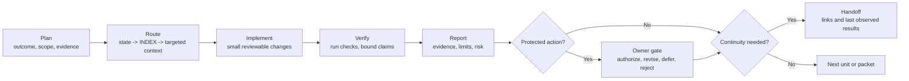
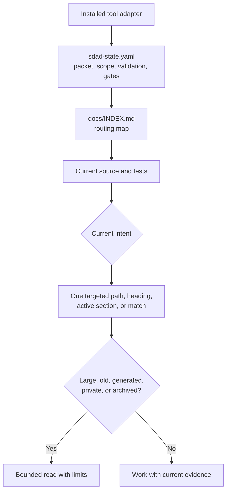
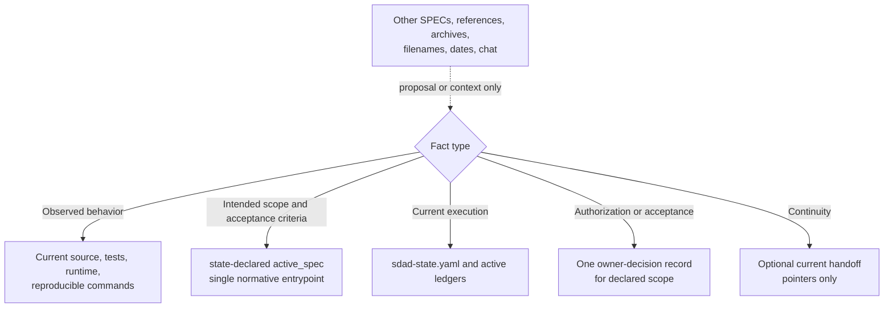
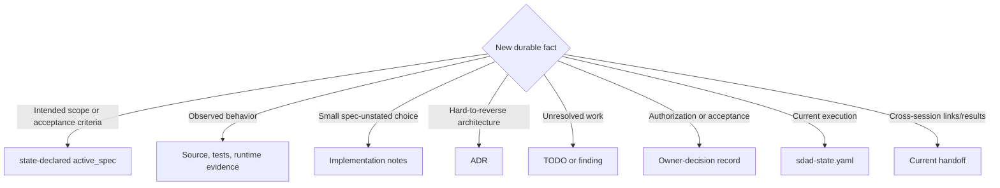
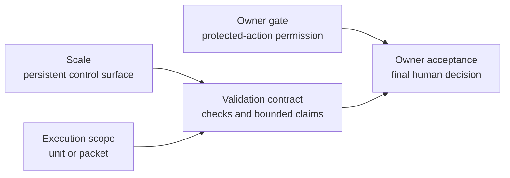
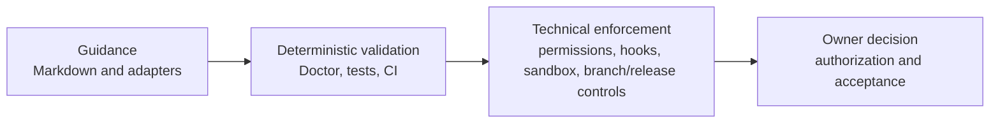
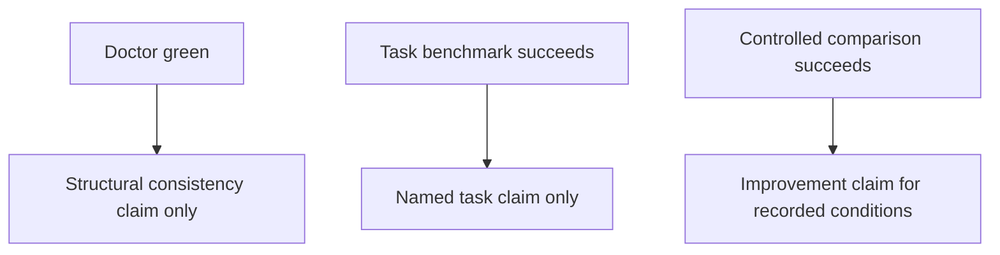

# Diagrams

Status: Active reference

## One Work Loop

Owner gate and handoff are triggered branches, not extra loop modes.

## Fresh Context Route

`routed_docs` is an eligible selection set. It is never a startup instruction
to read every listed file.

## Authority And Continuity

`SPEC-COMPLETE.md` is an integrated baseline, not an automatic override. Owner
acceptance does not upgrade weak evidence. A new state-v2 project does not use
`save-state.md`; an existing copy is state-v1 migration input only.

## One Fact, One Home

A handoff uses Authority Pointers; it does not duplicate these records.

## Three Control Axes

Scale does not grant permission. Execution scope does not accept risk. Validation
does not imply owner acceptance.

## Guidance Through Owner Decision

Each layer has a different job. Tool-native plans, sessions, checkpoints,
memory, or doctor features may be useful diagnostics, but they are not SDAD
state, handoff, Doctor, or owner authority.

## Evidence Claim Ladder

## Rendered Diagram Assets

Use these when a static or interactive visual is more useful than Mermaid:

- `assets/spec-driven-ai-development-infographic.png`: confirmed SDAD 3.0
  artwork used as the current SDAD Protocol 3.2 public overview in the README.
  Its embedded `Spec-Driven` label is historical; current protocol wording is
  SPEC-Directed AI Development.
- `assets/spec-driven-ai-development-infographic.svg`: separate legacy,
  versionless progressive-control-plane companion visual; it is not the
  editable source for the README PNG.
- `assets/sdad-control-loop.archify.png`: rendered SDAD Control Loop diagram.
- `assets/sdad-control-loop.archify.html`: interactive Archify export for the
  same control loop.
- `assets/sdad-control-loop.archify.workflow.json`: source workflow used to
  regenerate the Archify export.

Rendered assets are explanatory references. They do not outrank the active
SPEC, source code, tests, current control files, or validator output.
