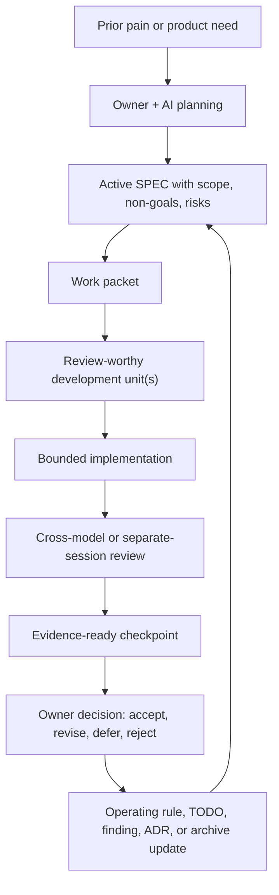
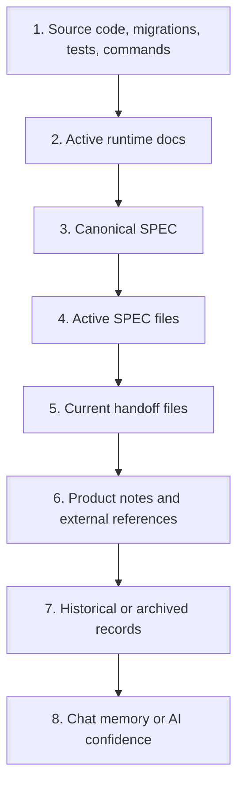
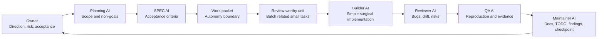
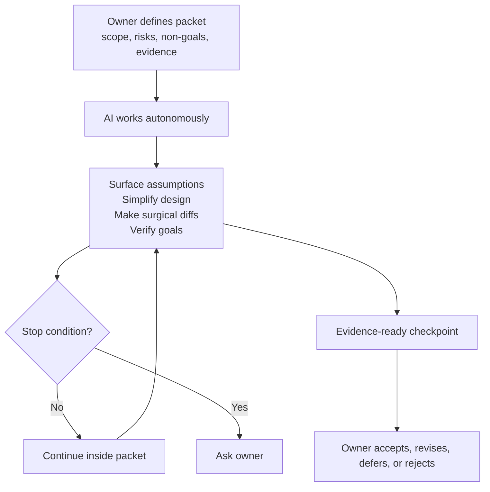
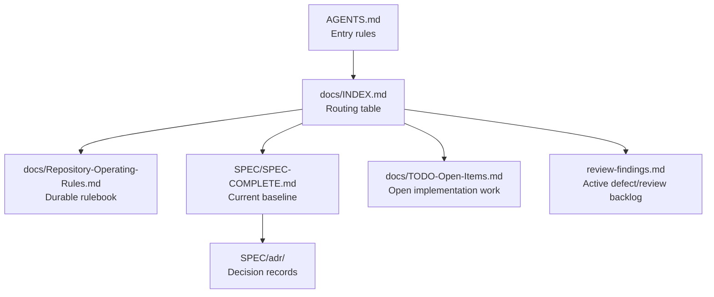

# Diagrams

Status: Active reference
Scope: Visual overview of SPEC-driven AI development

## Operating Loop

## Source Of Truth Order

Read this as precedence: when two sources disagree, prefer the higher source.
Inside SPECs, current active sections override older historical sections.

## Role Split

One AI session may perform more than one role, but risky work should receive an
independent review or QA pass.

## Autonomy Boundary

## Control Files

