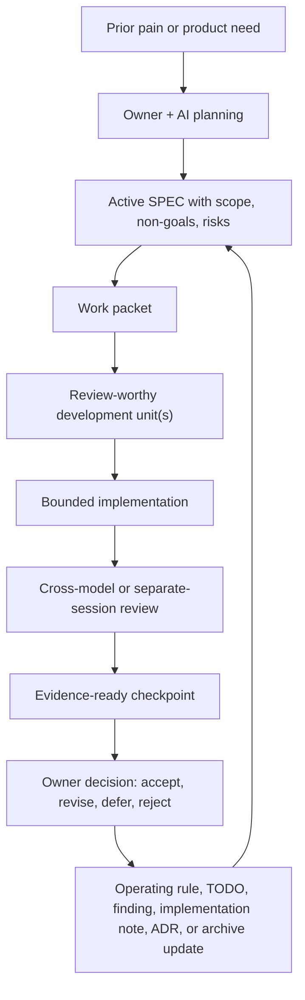
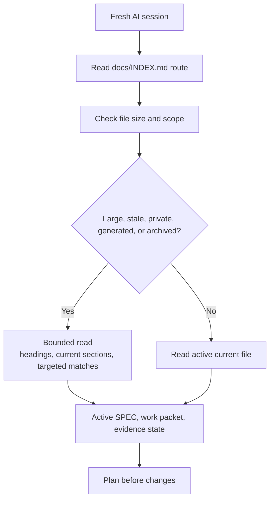
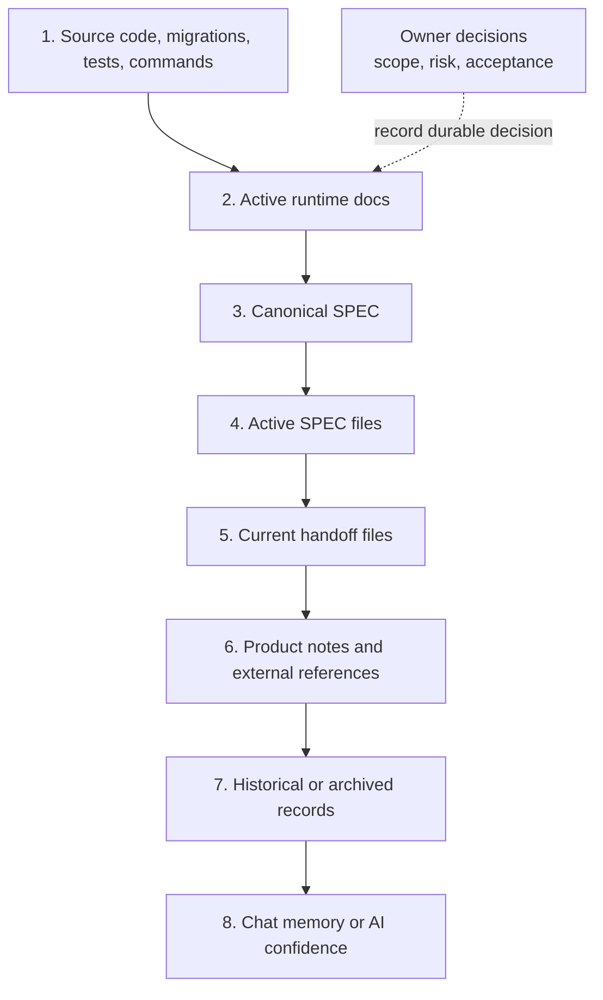
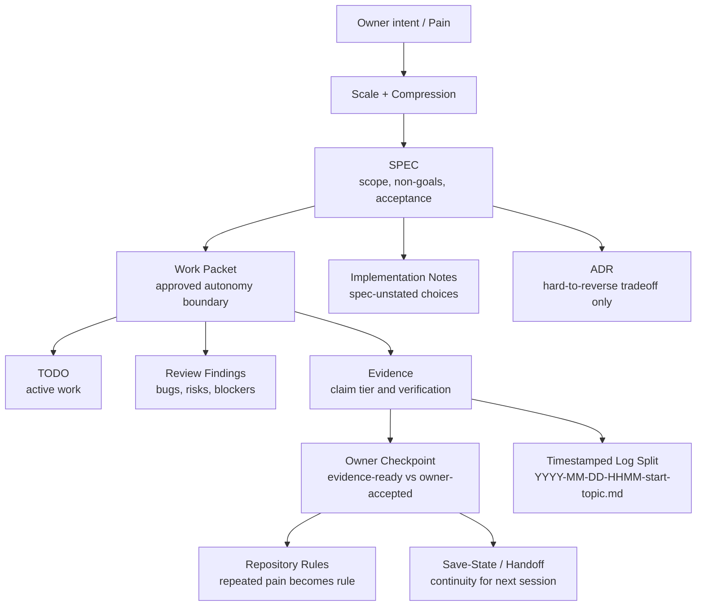
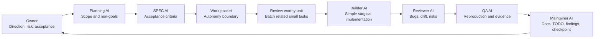
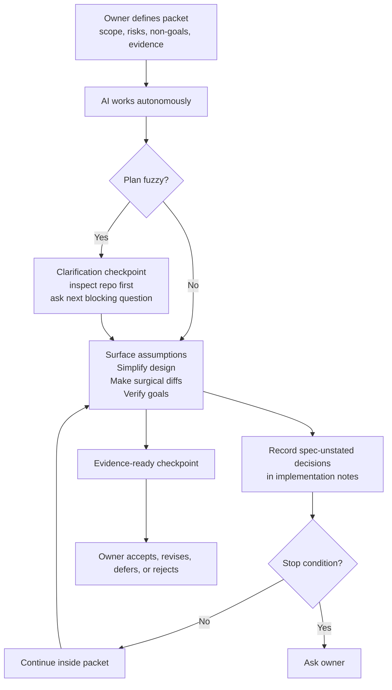
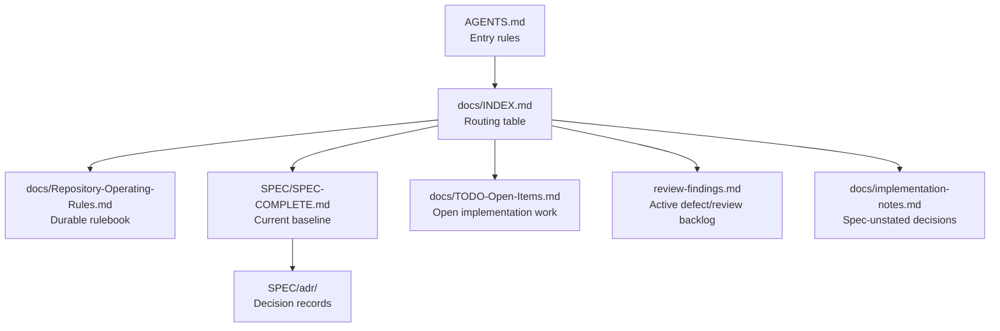

# Diagrams

Status: Active reference
Scope: Visual overview of SPEC-driven AI development

## Operating Loop

## Fresh Session Start Guard

Use this guard before mandatory first-read files. The start loop routes the
session; it does not authorize full reads of large state files, old handoffs,
logs, generated artifacts, private data, or archives.

## Source Of Truth Order

Read this as precedence: when two sources disagree, prefer the higher source.
Inside SPECs, current active sections override older historical sections.
Owner decisions gate scope, risk, and acceptance; record durable decisions in
active docs, SPEC, ADR, or claim registry. Owner acceptance does not upgrade
weak evidence into a stronger evidence tier.

## Document Relationship Map

Use `docs/INDEX.md` as the working router while the packet is active. It tells
the AI which current document to check at each moment and when to route long
logs, traces, or evidence records into timestamped split files instead of
growing an active state file.

## Role Split

One AI session may perform more than one role, but risky work should receive an
independent review or QA pass.

## Autonomy Boundary

## Control Files

## Rendered Diagram Assets

Use these when a static or interactive visual is more useful than Mermaid:

- `assets/spec-driven-ai-development-infographic.png`: public overview
  infographic used by the README.
- `assets/sdad-control-loop.archify.png`: rendered SDAD Control Loop diagram.
- `assets/sdad-control-loop.archify.html`: interactive Archify export for the
  same control loop.
- `assets/sdad-control-loop.archify.workflow.json`: source workflow used to
  regenerate the Archify export.

Rendered assets are explanatory references. They do not outrank the active
SPEC, source code, tests, current control files, or validator output.
